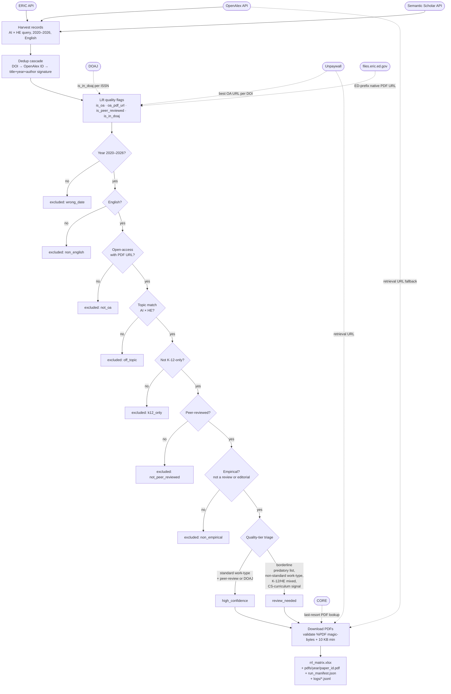

# AI in Higher Education RRL Pipeline

A Python CLI that harvests, deduplicates, screens, and downloads **open-access** academic papers on AI / GenAI / ChatGPT / LLM **adoption** in higher education, then produces an RRL (review-of-related-literature) matrix in xlsx, the downloaded PDFs, and structured logs.

## What this is for

A reproducible, auditable corpus you can read and cite. Two output tiers — `high_confidence` and `review_needed` — surface borderline papers for manual judgment rather than silently dropping them.

## Scope

**Included.** Faculty using ChatGPT / LLMs to teach. Students using AI tools for coursework (surveys, attitudes, academic integrity, learning outcomes). Institutional policy / governance. AI-literacy programs that teach students *to use* AI.

**Excluded.** K-12-only contexts. AI/ML as a CS subject ("AI-as-curriculum"). Closed-access papers. Non-English papers. Conceptual/opinion pieces and literature/systematic reviews (the screen requires empirical work with data).

**Date range:** 2020–2026, tagged `pre_chatgpt` (≤2022) and `post_chatgpt` (≥2023).

**Sources used:** OpenAlex (primary), ERIC (education-specific gray lit), Semantic Scholar (broad). DOAJ + Unpaywall for quality + OA verification. CrossRef + CORE on demand.

## How it works

A single `rrl` command kicks off the whole pipeline. Records flow from three open scholarly indexes through a deduplication cascade, a quality-flag enrichment pass, a seven-stage screening cascade, and a quality-tier triage before being downloaded and exported. Every stage is idempotent — interrupt it and the next run picks up where it left off.

The diagram below uses three shape conventions: **rounded boxes = external services**, **rectangles = pipeline stages or outputs**, **diamonds = decisions**. Dashed lines mark either an enrichment-time service lookup or an exclusion branch out of the main flow.



## How to run

This section walks a brand-new clone of the repo through the full pipeline. The pipeline is **resumable** — every stage writes incrementally to `data/rrl.sqlite` and skips work it has already done, so killing any command and rerunning it picks up where it left off.

### 1. Prerequisites

- **Python 3.11+** (`requires-python = ">=3.11"` in `pyproject.toml`).
- **macOS or Linux** (tested). Windows works through WSL.
- ~5 GB of disk for the SQLite DB + downloaded PDFs on a full run.
- **API keys** (see below).

#### API keys

| Variable | Required? | Where to get it | What it does |
| --- | --- | --- | --- |
| `OPENALEX_EMAIL` | **Yes** | Your real email | Goes in the User-Agent for OpenAlex's polite pool and is the `email=` param for Unpaywall. Both APIs hard-fail on a missing/placeholder value (Unpaywall returns 422). |
| `SEMANTIC_SCHOLAR_API_KEY` | Practically yes | Free at <https://www.semanticscholar.org/product/api> (request form, ~1 business day) | Lifts S2 from 1 req/s to 5 req/s. Without it, S2 harvest takes 3–4 hours; with it, ~30 minutes. The pipeline runs without it but is much slower. |
| `CORE_API_KEY` | Optional | Free at <https://core.ac.uk/services/api> | Fallback PDF lookup when Unpaywall + OpenAlex both lack a usable PDF URL for an included paper. Skippable for a first run. |

### 2. One-time setup

```bash
git clone <this repo>
cd "AI Higher Ed RRL"
python -m venv .venv
source .venv/bin/activate          # Windows: .venv\Scripts\activate
pip install -e ".[dev]"            # installs the `rrl` CLI + test deps
cp .env.example .env
$EDITOR .env                       # set OPENALEX_EMAIL at minimum
pytest -q                          # ~6s; confirms the install works
```

The `.env` file is read from the current working directory and *overrides* any matching shell-environment variables — set values in `.env`, not in your shell, so they're versioned alongside the run.

### 3. Run each stage individually

Stages share a single SQLite DB (`data/rrl.sqlite`); each stage reads what the prior stage wrote. You can run them one at a time to inspect intermediate results.

```bash
rrl harvest                 # 1. search OpenAlex + ERIC + S2 → raw_records table
rrl harvest --only s2       #    or just one adapter
rrl harvest --since 2026-01-01   # restrict to a publication date range

rrl dedup                   # 2. build canonical papers from raw_records
                            #    (DOI match → OpenAlex ID → title+year+author signature)
rrl dedup --review          #    write data/dedup_review.csv of likely duplicates
rrl dedup --merge L W       #    manually merge paper L into paper W

rrl enrich                  # 3. attach DOAJ + Unpaywall + OpenAlex quality flags
rrl enrich --only unpaywall #    re-run a single pass
                            #    (resumable: skips papers already checked)

rrl screen                  # 4. apply year/lang/OA + topic + peer-review +
                            #    empirical-only + tier filters
rrl screen --dry-run        #    print would-be exclusions without writing

rrl export                  # 5. download PDFs → write output/rrl_matrix.xlsx +
                            #    output/run_manifest.json + README appendix
rrl export --retry-failed   #    re-attempt papers marked oa_link_dead

rrl status                  # counts + last-run timestamps for every stage
rrl status --paper <PID>    # full lifecycle of one paper
```

### 4. Run everything at once

```bash
rrl all                     # harvest → dedup → enrich → screen → export
rrl all --skip harvest      # comma-separated stage names to skip
```

`rrl all` runs each stage in order. Stages already complete will short-circuit, so this is also a safe "resume" command.

### 5. How resumability works

Every stage either persists its progress incrementally or filters out already-processed rows:

- **`harvest`** records a `search_runs` row per adapter; a crashed harvest is restartable. Each `raw_record` is written as it's parsed, not at the end.
- **`dedup`** is fully derivable from `raw_records`; re-running is idempotent.
- **`enrich`** tracks per-paper checkpoints (`unpaywall_checked_at`, `doaj_checked_at`) so a killed run restarts at the next unchecked paper. Per-paper errors are caught + logged; one bad DOI does not abort the stage.
- **`screen`** recomputes decisions from scratch each run (cheap) and overwrites the `included` / `exclusion_reason` / `quality_tier` columns.
- **`export`** skips papers whose `pdf_status` is already `'downloaded'`; `--retry-failed` extends that to retry `'oa_link_dead'` too.

If you change the screen rules or API keys, just rerun the affected stages — no need to start over.

### 6. Outputs and where to find them

| Path | What it is |
| --- | --- |
| `output/rrl_matrix.xlsx` | The deliverable. Two sheets, `high_confidence` and `review_needed`. Bibliographic + quality flags only — no methods/findings columns (those you fill manually while reading). |
| `output/run_manifest.json` | Pipeline version, query-term hash, per-stage counts, SHA-256 of the xlsx, runtimes. For reproducibility / audit. |
| `pdfs/<year>/<paper_id>.pdf` | Downloaded OA PDFs, foldered by publication year. Filename is the internal `paper_id` so it joins back to the matrix on that key. |
| `logs/<stage>-YYYY-MM-DD.jsonl` | Per-stage structured logs (one JSON object per line). Every search query, dedup decision, screening rejection, and PDF attempt. |
| `data/rrl.sqlite` | Internal state, WAL mode. Inspectable with any SQLite client; safe to query while the pipeline is running. |
| The block below | Live run statistics, auto-overwritten between the auto-generated markers on every `rrl export`. |

### 7. Estimated run times (full corpus, no cache)

Wall-clock for a ~60k-paper harvest, on a typical home internet connection:

| Stage | Time | Notes |
| --- | --- | --- |
| `harvest` | 30–90 min | Dominated by S2 throttle — with an S2 API key, lower end; without, 3–4 h. |
| `dedup` | 1–2 min | Pure CPU; SQLite-local. |
| `enrich` (DOAJ) | 10–15 min | Fast: ISSN cache hits + many no-ISSN skips. |
| `enrich` (Unpaywall) | 1.5–4 h | One HTTP round-trip per DOI; Unpaywall responds at ~3 req/s. |
| `screen` | 5–10 s | In-memory + regex. |
| `export` | 30–60 min | Few-hundred PDFs * ~3 s each. Some hosts time out (60 s ceiling). |

If you only need a smoke test, `rrl harvest --only openalex --since 2026-01-01` finishes in under a minute.

## Limitations (read this before citing)

1. **OA-only corpus.** Significant closed-access literature in flagship journals (Computers & Education, Studies in Higher Education, Internet & Higher Education) is **not** in the matrix. This is *not* "the literature" — it is the open-access slice of it.
2. **No Scopus / Web of Science / EBSCO.** Those databases are paywalled and have no free API. A complete review would supplement this corpus with manual hand-searches in those indices.
3. **Topic boundary is regex-based.** The K-12-only / AI-as-curriculum exclusions and the AI/HE inclusion are keyword filters. The `review_needed` tier exists to surface borderline calls for human judgment.
4. **Predatory-venue detection is best-effort.** No comprehensive free machine-readable list exists. We use DOAJ membership + a tiny blocklist of universally-acknowledged repeat offenders. Anything dubious lands in `review_needed`.
5. **Dedup has known gaps.** Preprint/journal pairs without shared DOIs may both appear; `rrl dedup --review` surfaces likely duplicates for manual merge.
6. **Peer-review signal is uneven.** OpenAlex and ERIC carry explicit peer-review flags and are trusted; S2-only papers without an OpenAlex match cannot be confirmed peer-reviewed and are excluded by the protocol's strict gate.
7. **No content interpretation.** Methods, sample, findings, theoretical framework — those columns are intentionally absent. They cannot be auto-extracted reliably.
8. **English-only.** Significant work in Mandarin, Spanish, Portuguese, and other languages is excluded.

## For Developers

This section maps each pipeline stage in the "How it works" diagram to the module(s) that implement it. Shape conventions are the same — **rounded = external services**, **rectangles = code files or modules**, **cylinders = persistent storage / output artifacts**. Solid arrows mark a direct function call or import; dashed arrows mark a read/write against shared state (SQLite, logs, the rate-limited HTTP session, configuration).

```mermaid
flowchart TD
    %% Entry
    CLI[rrl/cli.py<br/>command dispatch:<br/>harvest · dedup · enrich · screen · export · all · status]

    %% Search adapters
    subgraph SEARCH["rrl/search/ — adapter package"]
        SBASE[base.py<br/>RawRecord · QuerySpec ·<br/>title/DOI normalisation]
        SOA[openalex.py]
        SERIC[eric.py]
        SS2[semantic_scholar.py]
        SCR[crossref.py]
        SCORE[core_api.py]
    end

    %% Dedup
    subgraph DEDUP_PKG["rrl/dedup/"]
        DG[grouping.py<br/>dedup_key + canonical builder]
        DM[merge.py]
        DR[review.py]
    end

    %% Enrich
    subgraph ENRICH_PKG["rrl/enrich/"]
        EOA[openalex_flags.py]
        EERIC[eric_flags.py]
        EDOAJ[doaj.py]
        EUPW[unpaywall.py]
    end

    %% Screen
    subgraph SCREEN_PKG["rrl/screen/"]
        SCR_X[runner.py]
        SCR_R[rules.py<br/>evaluate_paper · decide_quality_tier]
    end

    %% Output
    subgraph OUTPUT_PKG["rrl/output/"]
        OR[runner.py]
        OM[matrix.py]
        OP[pdf.py]
        OMF[manifest.py]
        OREADME[readme.py]
    end

    %% Wiring
    CLI -- harvest --> HARV[rrl/harvest.py]
    CLI -- dedup --> DG
    CLI -- enrich --> EOA
    CLI -- enrich --> EERIC
    CLI -- enrich --> EDOAJ
    CLI -- enrich --> EUPW
    CLI -- screen --> SCR_X
    CLI -- export --> OR

    HARV --> SOA
    HARV --> SERIC
    HARV --> SS2
    SCR_X --> SCR_R
    OR --> OM
    OR --> OP
    OR --> OMF
    OR --> OREADME
    OP --> SCORE

    %% External services
    SOA -- api.openalex.org --> SVC_OA([OpenAlex])
    SERIC -- api.ies.ed.gov --> SVC_ERIC([ERIC])
    SS2 -- api.semanticscholar.org --> SVC_S2([Semantic Scholar])
    SCR -- api.crossref.org --> SVC_CR([CrossRef])
    SCORE -- api.core.ac.uk --> SVC_CORE([CORE])
    EDOAJ -- doaj.org/api --> SVC_DOAJ([DOAJ])
    EUPW -- api.unpaywall.org --> SVC_UPW([Unpaywall])

    %% Shared / cross-cutting
    subgraph SHARED["Shared modules"]
        DB_F[db.py<br/>SQLite + schema]
        HTTP_F[http.py<br/>rate-limited session]
        CFG_F[config.py<br/>term lists + Settings]
        LOG_F[logging_setup.py<br/>structured JSONL]
    end

    HTTP_F -.-> SOA
    HTTP_F -.-> SERIC
    HTTP_F -.-> SS2
    HTTP_F -.-> EDOAJ
    HTTP_F -.-> EUPW
    HTTP_F -.-> SCORE
    HTTP_F -.-> SCR
    CFG_F -.-> HARV
    CFG_F -.-> SCR_R
    LOG_F -.-> HARV
    LOG_F -.-> SCR_X
    LOG_F -.-> OR

    %% Storage + artifacts
    SQLDB[(data/rrl.sqlite)]
    XLSX[(output/rrl_matrix.xlsx)]
    PDF_FS[(pdfs/year/paper_id.pdf)]
    LOGS[(logs/*.jsonl)]
    MANI[(output/run_manifest.json)]

    HARV -. writes raw_records .-> SQLDB
    DG -. writes papers + paper_sources .-> SQLDB
    EOA -. updates flags .-> SQLDB
    EERIC -. updates flags .-> SQLDB
    EDOAJ -. updates is_in_doaj .-> SQLDB
    EUPW -. updates oa_pdf_url .-> SQLDB
    SCR_X -. updates included + quality_tier .-> SQLDB
    OR -. reads .-> SQLDB
    DB_F -.owns schema.-> SQLDB
    OM --> XLSX
    OP --> PDF_FS
    OMF --> MANI
    LOG_F -.-> LOGS

    %% Sidecar packages
    TESTS[tests/<br/>120+ pytest cases<br/>mocked HTTP via responses lib]
    SCRIPTS[scripts/<br/>build_manuscript_docx.py]

    TESTS -. exercises every stage .-> CLI
```



Full design spec: `docs/superpowers/specs/2026-05-14-rrl-pipeline-design.md`.

## Development

```bash
pytest -q            # all tests; uses mocked HTTP via the `responses` library
ruff check rrl       # lint
mypy rrl             # types
```

No live API calls in CI. For a live smoke test: `rrl harvest --only=openalex --since 2026-01-01` (small slice).

<!-- BEGIN AUTO-GENERATED -->
## Run statistics

_Last run: 2026-05-20T00:29:13.183097+00:00_

**Corpus summary**
- raw_records: 95190
- after dedup: 77570
- after screen (included): 4860
- in matrix: 4831

**By quality tier**
- high_confidence: 1948
- review_needed: 2883

**By era**
- post_chatgpt: 4684
- pre_chatgpt: 176

**Exclusions**
- off_topic: 46660
- non_english: 8537
- k12_only: 202
- wrong_date: 0
- not_peer_reviewed: 1729
- non_empirical: 529

**Stage runtimes (seconds)**
- export_pdf: 46920.1
- export_matrix: 5.9

**By source adapter** _(records contributed before dedup)_
- eric: 16177
- openalex: 51372
- s2: 4922
- scopus: 22719

**PDF retrieval**
- downloaded: 2693
- not_retrievable: 2205
- success rate: 55.0%
<!-- END AUTO-GENERATED -->
