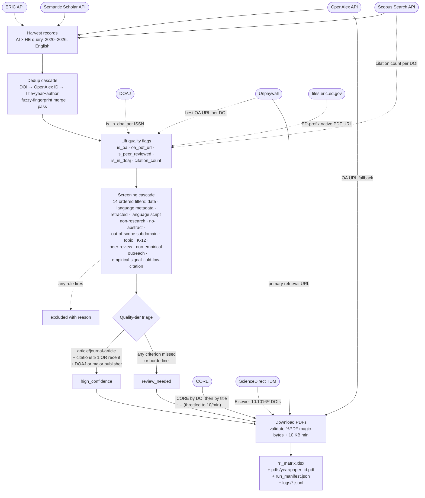
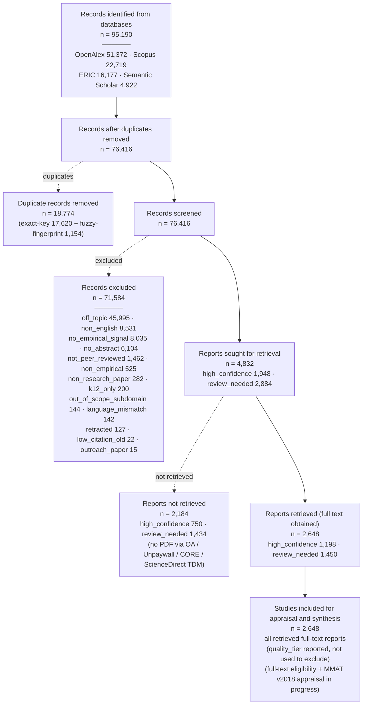
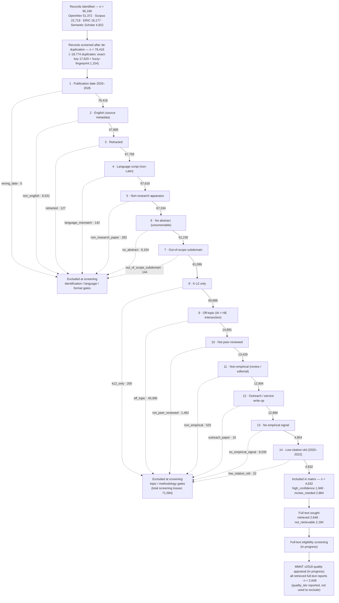

# AI in Higher Education RRL Pipeline

A Python CLI that harvests, deduplicates, screens, and downloads academic papers on AI / GenAI / ChatGPT / LLM **adoption** in higher education, then produces an RRL (review-of-related-literature) matrix in xlsx, the downloaded PDFs, and structured logs. Coverage spans four scholarly indexes (three open + one institutional-subscription), with full-text retrieval through the open-access cascade plus the ScienceDirect TDM API for Elsevier-published papers.

## What this is for

A reproducible, auditable corpus you can read and cite. Two output tiers — `high_confidence` and `review_needed` — surface borderline papers for manual judgment rather than silently dropping them. Papers passing screening but with no retrievable full text are reported as `not_retrievable` (distinct from formal exclusion) so the candidate worklist for interlibrary-loan retrieval stays visible.

> **Methodology version: v2 (2026-05-20).** This README and the live `output/` artefacts describe the post-pivot pipeline: four databases (OpenAlex, Scopus, ERIC, Semantic Scholar), no open-access restriction on inclusion, 14-stage screening, ScienceDirect TDM retrieval for Elsevier DOIs. The pre-pivot **v1** (three databases, open-access-only, 7-stage screening) is preserved for comparison in git history at tag `v1-pre-rescrape`.

## Scope

**Included.** Faculty using ChatGPT / LLMs to teach. Students using AI tools for coursework (surveys, attitudes, academic integrity, learning outcomes). Institutional policy / governance. AI-literacy programs that teach students *to use* AI.

**Excluded.** K-12-only contexts. AI/ML as a CS subject ("AI-as-curriculum"). Non-English papers. Conceptual/opinion pieces and literature/systematic reviews (the screen requires an empirical methodology signal in the abstract). Chinese ideological-political pedagogy subdomain. Retracted papers. Outreach / community-service writeups.

**Date range:** 2020–2026, tagged `pre_chatgpt` (≤2022) and `post_chatgpt` (≥2023).

**Sources used:** OpenAlex (primary), Scopus (institutional-subscription; Elsevier / T&F / Wiley / Sage coverage), ERIC (education-specific gray lit), Semantic Scholar (broad). DOAJ + Unpaywall for quality + OA verification. CrossRef + CORE on demand, plus ScienceDirect TDM for Elsevier `10.1016/*` full-text retrieval.

## How it works

A single `rrl` command kicks off the whole pipeline. Records flow from four scholarly indexes (three open + one institutional-subscription) through a deduplication cascade, a quality-flag enrichment pass, a fourteen-stage screening cascade, and a quality-tier triage before being downloaded and exported. Every stage is idempotent — interrupt it and the next run picks up where it left off.

The diagram below uses three shape conventions: **rounded boxes = external services**, **rectangles = pipeline stages or outputs**, **diamonds = decisions**. Dashed lines mark either an enrichment-time service lookup or an exclusion branch out of the main flow.


```mermaid
flowchart TD
    %% External search sources
    SVC_OA([OpenAlex API])
    SVC_ERIC([ERIC API])
    SVC_S2([Semantic Scholar API])
    SVC_SCO([Scopus Search API])

    %% Harvest + dedup
    SVC_OA --> HARV
    SVC_ERIC --> HARV
    SVC_S2 --> HARV
    SVC_SCO --> HARV
    HARV[Harvest records<br/>AI × HE query, 2020–2026, English] --> DEDUP[Dedup cascade<br/>DOI → OpenAlex ID → title+year+author<br/>+ fuzzy-fingerprint merge pass]

    %% Enrichment
    DEDUP --> ENR[Lift quality flags<br/>is_oa · oa_pdf_url · is_peer_reviewed · is_in_doaj · citation_count]
    SVC_DOAJ([DOAJ]) -. is_in_doaj per ISSN .-> ENR
    SVC_UPW([Unpaywall]) -. best OA URL per DOI .-> ENR
    SVC_ERICF([files.eric.ed.gov]) -. ED-prefix native PDF URL .-> ENR
    SVC_SCO -. citation count per DOI .-> ENR

    %% Screening cascade (condensed view)
    ENR --> SCREEN[Screening cascade<br/>14 ordered filters: date · language metadata ·<br/>retracted · language script · non-research · no-abstract ·<br/>out-of-scope subdomain · topic · K-12 ·<br/>peer-review · non-empirical · outreach ·<br/>empirical signal · old-low-citation]
    SCREEN -. any rule fires .-> XOUT[excluded with reason]
    SCREEN --> TIER{Quality-tier triage}
    TIER -- article/journal-article<br/>+ citations ≥ 1 OR recent<br/>+ DOAJ or major publisher --> HC[high_confidence]
    TIER -- any criterion missed<br/>or borderline --> RN[review_needed]

    %% Retrieval + output (cascade order: oa → core → sciencedirect)
    HC --> DL[Download PDFs<br/>validate %PDF magic-bytes + 10 KB min]
    RN --> DL
    SVC_UPW -->|"primary retrieval URL"| DL
    SVC_OA  -->|"OA URL fallback"| DL
    SVC_CORE([CORE]) -->|"CORE by DOI then by title (throttled to 10/min)"| DL
    SVC_SD([ScienceDirect TDM]) -->|"Elsevier 10.1016/* DOIs"| DL
    DL --> OUT[rrl_matrix.xlsx<br/>+ pdfs/year/paper_id.pdf<br/>+ run_manifest.json<br/>+ logs/*.jsonl]
```

## How to run

This section walks a brand-new clone of the repo through the full pipeline. The pipeline is **resumable** — every stage writes incrementally to `data/rrl.sqlite` and skips work it has already done, so killing any command and rerunning it picks up where it left off.

### 1. Prerequisites

- **Python 3.11+** (`requires-python = ">=3.11"` in `pyproject.toml`).
- **macOS or Linux** (tested). Windows works through WSL.
- ~5 GB of disk for the SQLite DB + downloaded PDFs on a full run.
- **API keys** (see below).

#### API keys

| Variable | Required? | Where to get it | What it does |
| --- | --- | --- | --- |
| `OPENALEX_EMAIL` | **Yes** | Your real email | Goes in the User-Agent for OpenAlex's polite pool and is the `email=` param for Unpaywall. Both APIs hard-fail on a missing/placeholder value (Unpaywall returns 422). |
| `SEMANTIC_SCHOLAR_API_KEY` | Practically yes | Free at <https://www.semanticscholar.org/product/api> (request form, ~1 business day) | Lifts S2 from 1 req/s to 5 req/s. Without it, S2 harvest takes 3–4 hours; with it, ~30 minutes. The pipeline runs without it but is much slower. |
| `ELSEVIER_API_KEY` | Practically yes | Institutional Scopus Search API key (free for institutional subscribers) | Enables Scopus harvest (22K+ subscription-tier records on a full run) and ScienceDirect TDM full-text retrieval for Elsevier-published papers (DOIs in `10.1016/*`). The pipeline runs without it but loses subscription-tier coverage. |
| `CORE_API_KEY` | Optional | Free at <https://core.ac.uk/services/api> | Fallback PDF lookup (rate-limited 10/min on the free tier) when OA URL / Unpaywall / ScienceDirect all lack a usable PDF for an included paper. Skippable for a first run. |

### 2. One-time setup

```bash
git clone <this repo>
cd "AI Higher Ed RRL"
python -m venv .venv
source .venv/bin/activate          # Windows: .venv\Scripts\activate
pip install -e ".[dev]"            # installs the `rrl` CLI + test deps
cp .env.example .env
$EDITOR .env                       # set OPENALEX_EMAIL at minimum
pytest -q                          # ~6s; confirms the install works
```

The `.env` file is read from the current working directory and *overrides* any matching shell-environment variables — set values in `.env`, not in your shell, so they're versioned alongside the run.

### 3. Run each stage individually

Stages share a single SQLite DB (`data/rrl.sqlite`); each stage reads what the prior stage wrote. You can run them one at a time to inspect intermediate results.

```bash
rrl harvest                 # 1. search OpenAlex + ERIC + S2 + Scopus → raw_records table
rrl harvest --only scopus   #    or just one adapter
rrl harvest --since 2026-01-01   # restrict to a publication date range

rrl dedup                   # 2. build canonical papers from raw_records
                            #    (DOI → OpenAlex ID → title+year+author signature
                            #     → fuzzy-fingerprint merge pass for DOI-less dupes)
rrl dedup --review          #    write data/dedup_review.csv of likely duplicates
rrl dedup --merge L W       #    manually merge paper L into paper W

rrl enrich                  # 3. attach DOAJ + Unpaywall + OpenAlex + Scopus quality flags
rrl enrich --only unpaywall #    re-run a single pass
                            #    (resumable: skips papers already checked)

rrl screen                  # 4. apply year/lang/OA + topic + peer-review +
                            #    empirical-only + tier filters
rrl screen --dry-run        #    print would-be exclusions without writing

rrl export                  # 5. download PDFs → write output/rrl_matrix.xlsx +
                            #    output/run_manifest.json + README appendix
rrl export --retry-failed   #    re-attempt papers marked oa_link_dead

rrl status                  # counts + last-run timestamps for every stage
rrl status --paper <PID>    # full lifecycle of one paper
```

### 4. Run everything at once

```bash
rrl all                     # harvest → dedup → enrich → screen → export
rrl all --skip harvest      # comma-separated stage names to skip
```

`rrl all` runs each stage in order. Stages already complete will short-circuit, so this is also a safe "resume" command.

### 5. How resumability works

Every stage either persists its progress incrementally or filters out already-processed rows:

- **`harvest`** records a `search_runs` row per adapter; a crashed harvest is restartable. Each `raw_record` is written as it's parsed, not at the end.
- **`dedup`** is fully derivable from `raw_records`; re-running is idempotent.
- **`enrich`** tracks per-paper checkpoints (`unpaywall_checked_at`, `doaj_checked_at`) so a killed run restarts at the next unchecked paper. Per-paper errors are caught + logged; one bad DOI does not abort the stage.
- **`screen`** recomputes decisions from scratch each run (cheap) and overwrites the `included` / `exclusion_reason` / `quality_tier` columns.
- **`export`** skips papers whose `pdf_status` is already `'downloaded'`; `--retry-failed` extends that to retry `'oa_link_dead'` too.

If you change the screen rules or API keys, just rerun the affected stages — no need to start over.

### 6. Outputs and where to find them

| Path | What it is |
| --- | --- |
| `output/rrl_matrix.xlsx` | The deliverable. Two sheets, `high_confidence` and `review_needed`. Bibliographic + quality flags only — no methods/findings columns (those you fill manually while reading). Includes `pdf_status=not_retrievable` rows for PRISMA transparency. |
| `output/rrl_matrix_pdfs_only.xlsx` | Same two-sheet layout as `rrl_matrix.xlsx`, restricted to papers whose PDF was successfully downloaded — the "rows whose full text you can open right now" view. Auto-emitted alongside the canonical matrix on every `rrl export`. Current corpus: 2,648 of the 4,832 matrix-set papers. |
| `output/run_manifest.json` | Pipeline version, query-term hash, per-stage counts, SHA-256 of the xlsx, runtimes. For reproducibility / audit. |
| `pdfs/<year>/<paper_id>.pdf` | Downloaded OA PDFs, foldered by publication year. Filename is the internal `paper_id` so it joins back to the matrix on that key. |
| `logs/<stage>-YYYY-MM-DD.jsonl` | Per-stage structured logs (one JSON object per line). Every search query, dedup decision, screening rejection, and PDF attempt. |
| `data/rrl.sqlite` | Internal state, WAL mode. Inspectable with any SQLite client; safe to query while the pipeline is running. |
| The block below | Live run statistics, auto-overwritten between the auto-generated markers on every `rrl export`. |

### 7. Estimated run times (full corpus, no cache)

Wall-clock for a ~60k-paper harvest, on a typical home internet connection:

| Stage | Time | Notes |
| --- | --- | --- |
| `harvest` | 30–90 min | Dominated by S2 throttle — with an S2 API key, lower end; without, 3–4 h. |
| `dedup` | 1–2 min | Pure CPU; SQLite-local. |
| `enrich` (DOAJ) | 10–15 min | Fast: ISSN cache hits + many no-ISSN skips. |
| `enrich` (Unpaywall) | 1.5–4 h | One HTTP round-trip per DOI; Unpaywall responds at ~3 req/s. |
| `screen` | 5–10 s | In-memory + regex. |
| `export` | 30–60 min | Few-hundred PDFs * ~3 s each. Some hosts time out (60 s ceiling). |

If you only need a smoke test, `rrl harvest --only openalex --since 2026-01-01` finishes in under a minute.

## Limitations (read this before citing)

1. **Publisher skew in the retrievable set.** Full-text retrieval works through OA URLs (Unpaywall / OpenAlex direct), CORE, and the **ScienceDirect TDM API for Elsevier `10.1016/*` papers** (100% reliable in this run, 153/153). Subscription-tier content from Taylor & Francis, Wiley, and Sage is identified through Scopus metadata but not retrievable through the automated cascade and appears as `not_retrievable` in the matrix unless the paper also has an open-access URL. The 45% not-retrievable rate is concentrated here.
2. **No Web of Science or EBSCO.** Those two databases have no free API and were not searched. With OpenAlex, Scopus, ERIC, and Semantic Scholar together the omission gap is narrower than v1 (which lacked Scopus) but still non-zero.
3. **Topic boundary is regex-based, restricted to title + abstract head.** AI × HE intersection must appear in the title or the first 300 characters of the abstract (the v2 tightening). The `review_needed` tier surfaces borderline calls for human judgment.
4. **Predatory-venue detection is best-effort.** No comprehensive free machine-readable list exists. We use DOAJ membership + a tiny blocklist of universally-acknowledged repeat offenders. Anything dubious lands in `review_needed`.
5. **Dedup has residual gaps.** The fuzzy-fingerprint pass collapsed 1,154 DOI-less duplicates in v2, but preprint/journal pairs whose titles drift substantially between platforms may still escape; `rrl dedup --review` surfaces remaining candidates for manual merge.
6. **Peer-review signal is uneven.** OpenAlex, Scopus, and ERIC carry explicit peer-review flags and are trusted; S2-only papers without a corroborating source are excluded by the protocol's strict gate.
7. **No content interpretation.** Methods, sample, findings, theoretical framework — those columns are intentionally absent. They cannot be auto-extracted reliably.
8. **English-only.** Significant work in Mandarin, Spanish, Portuguese, and other languages is excluded.

## For Developers

This section maps each pipeline stage in the "How it works" diagram to the module(s) that implement it. Shape conventions are the same — **rounded = external services**, **rectangles = code files or modules**, **cylinders = persistent storage / output artifacts**. Solid arrows mark a direct function call or import; dashed arrows mark a read/write against shared state (SQLite, logs, the rate-limited HTTP session, configuration).


```mermaid
flowchart TD
    %% Entry
    CLI[rrl/cli.py<br/>command dispatch:<br/>harvest · dedup · enrich · screen · export · all · status]

    %% Search adapters
    subgraph SEARCH["rrl/search/ — adapter package"]
        SBASE[base.py<br/>RawRecord · QuerySpec ·<br/>title/DOI normalisation]
        SOA[openalex.py]
        SERIC[eric.py]
        SS2[semantic_scholar.py]
        SSCO[scopus.py]
        SCR[crossref.py]
        SCORE[core_api.py]
    end

    %% Dedup
    subgraph DEDUP_PKG["rrl/dedup/"]
        DG[grouping.py<br/>dedup_key + canonical builder]
        DM[merge.py]
        DR[review.py]
    end

    %% Enrich
    subgraph ENRICH_PKG["rrl/enrich/"]
        EOA[openalex_flags.py]
        EERIC[eric_flags.py]
        EDOAJ[doaj.py]
        EUPW[unpaywall.py]
        ESCO[scopus_citations.py]
    end

    %% Screen
    subgraph SCREEN_PKG["rrl/screen/"]
        SCR_X[runner.py]
        SCR_R[rules.py<br/>evaluate_paper · decide_quality_tier]
    end

    %% Output
    subgraph OUTPUT_PKG["rrl/output/"]
        OR[runner.py]
        OM[matrix.py]
        OP[pdf.py]
        OMF[manifest.py]
        OREADME[readme.py]
    end

    %% Wiring
    CLI -- harvest --> HARV[rrl/harvest.py]
    CLI -- dedup --> DG
    CLI -- enrich --> EOA
    CLI -- enrich --> EERIC
    CLI -- enrich --> EDOAJ
    CLI -- enrich --> EUPW
    CLI -- screen --> SCR_X
    CLI -- export --> OR

    HARV --> SOA
    HARV --> SERIC
    HARV --> SS2
    SCR_X --> SCR_R
    OR --> OM
    OR --> OP
    OR --> OMF
    OR --> OREADME
    OP --> SCORE

    %% External services
    SOA -- api.openalex.org --> SVC_OA([OpenAlex])
    SERIC -- api.ies.ed.gov --> SVC_ERIC([ERIC])
    SS2 -- api.semanticscholar.org --> SVC_S2([Semantic Scholar])
    SCR -- api.crossref.org --> SVC_CR([CrossRef])
    SCORE -- api.core.ac.uk --> SVC_CORE([CORE])
    EDOAJ -- doaj.org/api --> SVC_DOAJ([DOAJ])
    EUPW -- api.unpaywall.org --> SVC_UPW([Unpaywall])

    %% Shared / cross-cutting
    subgraph SHARED["Shared modules"]
        DB_F[db.py<br/>SQLite + schema]
        HTTP_F[http.py<br/>rate-limited session]
        CFG_F[config.py<br/>term lists + Settings]
        LOG_F[logging_setup.py<br/>structured JSONL]
    end

    HTTP_F -.-> SOA
    HTTP_F -.-> SERIC
    HTTP_F -.-> SS2
    HTTP_F -.-> EDOAJ
    HTTP_F -.-> EUPW
    HTTP_F -.-> SCORE
    HTTP_F -.-> SCR
    CFG_F -.-> HARV
    CFG_F -.-> SCR_R
    LOG_F -.-> HARV
    LOG_F -.-> SCR_X
    LOG_F -.-> OR

    %% Storage + artifacts
    SQLDB[(data/rrl.sqlite)]
    XLSX[(output/rrl_matrix.xlsx)]
    PDF_FS[(pdfs/year/paper_id.pdf)]
    LOGS[(logs/*.jsonl)]
    MANI[(output/run_manifest.json)]

    HARV -. writes raw_records .-> SQLDB
    DG -. writes papers + paper_sources .-> SQLDB
    EOA -. updates flags .-> SQLDB
    EERIC -. updates flags .-> SQLDB
    EDOAJ -. updates is_in_doaj .-> SQLDB
    EUPW -. updates oa_pdf_url .-> SQLDB
    SCR_X -. updates included + quality_tier .-> SQLDB
    OR -. reads .-> SQLDB
    DB_F -.owns schema.-> SQLDB
    OM --> XLSX
    OP --> PDF_FS
    OMF --> MANI
    LOG_F -.-> LOGS

    %% Sidecar packages
    TESTS[tests/<br/>206 pytest cases<br/>mocked HTTP via responses lib]
    SCRIPTS[scripts/<br/>probe_sciencedirect · probe_abstract_backfill]

    TESTS -. exercises every stage .-> CLI
```

## Development

```bash
pytest -q            # all tests; uses mocked HTTP via the `responses` library
ruff check rrl       # lint
mypy rrl             # types
```

No live API calls in CI. For a live smoke test: `rrl harvest --only=openalex --since 2026-01-01` (small slice).

## PRISMA 2020 flow

The corpus funnel below renders from the same per-stage counts as the auto-generated run statistics at the foot of this README (regenerated from `data/rrl.sqlite` on every `rrl export`). Two manual steps run downstream of retrieval and are still in progress: full-text eligibility screening of the 2,648 retrieved reports, then **MMAT** (Mixed Methods Appraisal Tool, v2018) quality appraisal applied to **all 2,648 reports with retrievable full text** (high_confidence 1,198 + review_needed 1,450). The `quality_tier` split is a **reported study characteristic** — venue-recognition confidence (chiefly DOAJ / major-publisher listing) — **not an appraisal gate**: no study is dropped from appraisal on its tier, and consistent with the MMAT user guide no study is excluded on methodological-quality grounds. Appraisal results are reported per criterion with sensitivity analyses (including by venue tier). The only included reports not appraised are the 2,184 `not_retrievable` ones, which lack full text. The flow therefore ends at the matrix / retrieval stage rather than at final synthesis.

**Conventional PRISMA box** — screening losses collapsed into a single node:


```mermaid
flowchart TD
    DB["Records identified from databases<br/>n = 95,190<br/>──────<br/>OpenAlex 51,372 · Scopus 22,719<br/>ERIC 16,177 · Semantic Scholar 4,922"]
    DEDUP["Records after duplicates removed<br/>n = 76,416"]
    DUPS["Duplicate records removed<br/>n = 18,774<br/>(exact-key 17,620 + fuzzy-fingerprint 1,154)"]
    SCREEN["Records screened<br/>n = 76,416"]
    SCREEN_EX["Records excluded<br/>n = 71,584<br/>──────<br/>off_topic 45,995 · non_english 8,531<br/>no_empirical_signal 8,035 · no_abstract 6,104<br/>not_peer_reviewed 1,462 · non_empirical 525<br/>non_research_paper 282 · k12_only 200<br/>out_of_scope_subdomain 144 · language_mismatch 142<br/>retracted 127 · low_citation_old 22 · outreach_paper 15"]
    SEEK["Reports sought for retrieval<br/>n = 4,832<br/>high_confidence 1,948 · review_needed 2,884"]
    NOT_RET["Reports not retrieved<br/>n = 2,184<br/>high_confidence 750 · review_needed 1,434<br/>(no PDF via OA / Unpaywall / CORE / ScienceDirect TDM)"]
    RET["Reports retrieved (full text obtained)<br/>n = 2,648<br/>high_confidence 1,198 · review_needed 1,450"]
    APPR["Studies included for appraisal and synthesis<br/>n = 2,648<br/>all retrieved full-text reports<br/>(quality_tier reported, not used to exclude)<br/>(full-text eligibility + MMAT v2018 appraisal in progress)"]

    DB --> DEDUP
    DEDUP -. duplicates .-> DUPS
    DEDUP --> SCREEN
    SCREEN -. excluded .-> SCREEN_EX
    SCREEN --> SEEK
    SEEK -. not retrieved .-> NOT_RET
    SEEK --> RET
    RET --> APPR
```

**Per-criterion drop-off cascade** — the same screening losses, gate by gate. Each excluded paper carries one canonical reason (the first gate to fire), so the spine shows the running count still under consideration and each dashed branch shows that gate's drop-off. Gates run in the exact order of `rrl/screen/rules.py` — the order that produced the per-reason counts — and the spine lands exactly on the 4,832 included papers:


```mermaid
flowchart TD
    ID["Records identified — n = 95,190<br/>OpenAlex 51,372 · Scopus 22,719 · ERIC 16,177 · Semantic Scholar 4,922"]
    DD["Records screened after de-duplication — n = 76,416<br/>(−18,774 duplicates: exact-key 17,620 + fuzzy-fingerprint 1,154)"]
    ID --> DD --> F1

    F1["1 · Publication date 2020–2026"] -. "wrong_date · 0" .-> XA
    F1 -->|"76,416"| F2
    F2["2 · English (source metadata)"] -. "non_english · 8,531" .-> XA
    F2 -->|"67,885"| F3
    F3["3 · Retracted"] -. "retracted · 127" .-> XA
    F3 -->|"67,758"| F4
    F4["4 · Language script (non-Latin)"] -. "language_mismatch · 142" .-> XA
    F4 -->|"67,616"| F5
    F5["5 · Non-research apparatus"] -. "non_research_paper · 282" .-> XA
    F5 -->|"67,334"| F6
    F6["6 · No abstract (unscreenable)"] -. "no_abstract · 6,104" .-> XA
    F6 -->|"61,230"| F7
    F7["7 · Out-of-scope subdomain"] -. "out_of_scope_subdomain · 144" .-> XA
    F7 -->|"61,086"| F8
    F8["8 · K-12 only"] -. "k12_only · 200" .-> XB
    F8 -->|"60,886"| F9
    F9["9 · Off-topic (AI × HE intersection)"] -. "off_topic · 45,995" .-> XB
    F9 -->|"14,891"| F10
    F10["10 · Not peer-reviewed"] -. "not_peer_reviewed · 1,462" .-> XB
    F10 -->|"13,429"| F11
    F11["11 · Non-empirical (review / editorial)"] -. "non_empirical · 525" .-> XB
    F11 -->|"12,904"| F12
    F12["12 · Outreach / service write-up"] -. "outreach_paper · 15" .-> XB
    F12 -->|"12,889"| F13
    F13["13 · No empirical signal"] -. "no_empirical_signal · 8,035" .-> XB
    F13 -->|"4,854"| F14
    F14["14 · Low-citation old (2020–2022)"] -. "low_citation_old · 22" .-> XB
    F14 -->|"4,832"| INC

    XA["Excluded at screening<br/>identification / language / format gates"]
    XB["Excluded at screening<br/>topic / methodology gates<br/>(total screening losses: 71,584)"]

    INC["Included in matrix — n = 4,832<br/>high_confidence 1,948 · review_needed 2,884"]
    INC --> RET["Full text sought<br/>retrieved 2,648 · not_retrievable 2,184"]
    RET --> ELIG["Full-text eligibility screening<br/>(in progress)"]
    ELIG --> APP["MMAT v2018 quality appraisal (in progress)<br/>all retrieved full-text reports · n = 2,648<br/>(quality_tier reported, not used to exclude)"]
```

## Appraisal scope

From retrieval onward, **MMAT (v2018) quality appraisal is applied to every included report with retrievable full text — n = 2,648.** Of the 4,832 included reports:

- **2,648** — included reports with retrievable full text → carried forward to full-text eligibility and MMAT appraisal (high_confidence 1,198 + review_needed 1,450). **This is the appraisal working set.**
- **2,184** — `not_retrievable` (no PDF via OA / Unpaywall / CORE / ScienceDirect TDM; high_confidence 750 + review_needed 1,434) → interlibrary-loan worklist; cannot be appraised without full text.

The `quality_tier` (high_confidence / review_needed) is a **reported characteristic** capturing venue-recognition confidence (chiefly DOAJ / major-publisher listing), **not a filter on appraisal**. It is reported alongside the MMAT results and used as a **sensitivity dimension** (do findings hold across venue tiers?), rather than to exclude studies. Consistent with the MMAT user guide, **no study is excluded on methodological-quality grounds**: quality is described and its influence explored via sensitivity analysis.

The auto-generated run statistics below describe the full corpus pipeline (all 4,832 included reports); the **2,648** above is the appraisal working set.

<!-- BEGIN AUTO-GENERATED -->
## Run statistics

_Last run: 2026-06-02T10:21:31.969853+00:00_

**Corpus pipeline** — what happened, stage by stage
- raw_records: **95,190** — harvested across all configured search adapters
- after exact-key dedup: **77,570** — collapsed 17,620 duplicates (18.5% dedup rate) via the DOI → OpenAlex ID → title+year+author cascade
- after fuzzy-merge pass: **76,416** — an additional **1,154** DOI-less duplicates collapsed by the first-6-words + year + author-surname fingerprint
- excluded by screening: **71,584** (93.7% of post-dedup) — one canonical reason per paper
- in matrix (included, non-merged): **4,832** — the final analysis set

**By quality tier** _(matrix set)_
- high_confidence: **1,948** (40.3%) — work_type article + citations ≥ 1 or recent + DOAJ/major publisher
- review_needed: **2,884** (59.7%) — surfaced for manual review

**By era** _(matrix set)_
- post_chatgpt (2023–2026): **4,657**
- pre_chatgpt (2020–2022): **175**

**Exclusion reasons** _(first filter to fire wins)_
- off_topic: **45,995**
- non_english: **8,531**
- no_empirical_signal: **8,035**
- no_abstract: **6,104**
- not_peer_reviewed: **1,462**
- non_empirical: **525**
- non_research_paper: **282**
- k12_only: **200**
- out_of_scope_subdomain: **144**
- language_mismatch: **142**
- retracted: **127**
- low_citation_old: **22**
- outreach_paper: **15**

**By source adapter** _(records contributed before dedup)_
- openalex: **51,372**
- scopus: **22,719**
- eric: **16,177**
- s2: **4,922**

**PDF retrieval** _(matrix set)_
- downloaded: **2,648** (54.8% success rate)
- not_retrievable: **2,184** — candidate worklist for interlibrary-loan retrieval

**Per-source PDF attempts** _(which retrieval source delivered each download)_

| Source | Downloads | Attempts | Hit rate |
|---|---:|---:|---:|
| oa | 1,985 | 2,740 | 72.4% |
| core_doi | 510 | 730 | 69.9% |
| sciencedirect | 153 | 153 | 100.0% |
| core_title | 45 | 95 | 47.4% |

**Stage runtimes (seconds)**
- export_pdf: 0.3
- export_matrix: 8.6
<!-- END AUTO-GENERATED -->
