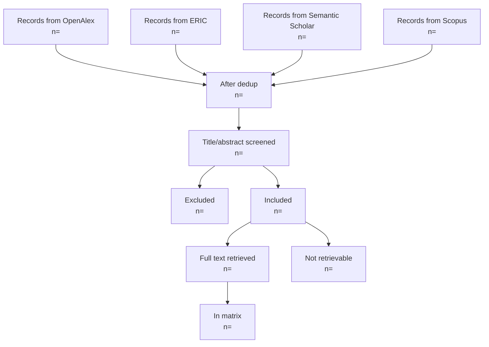

# Rescrape + Elsevier Integration — Implementation Plan

> **For agentic workers:** REQUIRED SUB-SKILL: Use superpowers:subagent-driven-development (recommended) or superpowers:executing-plans to implement this plan task-by-task. Steps use checkbox (`- [ ]`) syntax for tracking.

**Goal:** Clean-slate rescrape of the AI in Higher Ed RRL pipeline with a 4th database (Elsevier/Scopus), OA-only constraint lifted, and regenerated manuscript v2.

**Architecture:** Add `ScopusAdapter` mirroring the existing 3-adapter pattern (Protocol-based, persisted via `harvest.py` → `raw_records`). Add ScienceDirect TDM fallback inline in `download_pdfs` gated on Elsevier DOI prefix + successful probe. Remove `not_oa` screen exclusion; surface `pdf_status` in matrix. Wipe DB/PDFs/logs with rename-don't-delete safety net. Full pipeline rerun, then regenerate manuscript v2, PRISMA, README.

**Tech Stack:** Python 3.11, requests + urllib3 retry, SQLite (raw SQL, no ORM), Click CLI, pytest with `responses` library mocking, openpyxl, Mermaid for PRISMA diagrams.

**Spec:** `docs/superpowers/specs/2026-05-18-rescrape-and-elsevier-design.md`

---

## File map

### New files
- `scripts/probe_sciencedirect.py` — 1-DOI TDM smoke test
- `rrl/search/scopus.py` — Scopus Search API adapter
- `rrl/enrich/scopus_citations.py` — citation_count fallback via Abstract Retrieval
- `tests/test_search_scopus.py`
- `tests/test_enrich_scopus_citations.py`
- `tests/fixtures/scopus_page1.json` and `scopus_page2.json`
- `docs/archive/specs/` and `docs/archive/plans/` (directories)

### Modified files
- `.env.example` (+ELSEVIER_API_KEY)
- `rrl/config.py` (Settings + RATE_PLANS)
- `rrl/db.py` (+scopus_checked_at column)
- `rrl/harvest.py` (ADAPTERS + dispatch)
- `rrl/output/pdf.py` (ScienceDirect fallback, status taxonomy)
- `rrl/output/runner.py` (elsevier_api_key plumb, counts update)
- `rrl/output/matrix.py` (drop pdf filter, add pdf_status column)
- `rrl/screen/rules.py` (delete not_oa lines)
- `rrl/cli.py` (--scopus enrich + key passthrough)
- `scripts/build_manuscript_docx.py` (--version arg)
- `tests/test_screen_rules.py`, `tests/test_output_matrix.py`, `tests/test_output_pdf.py`, `tests/test_config.py`, `tests/test_harvest.py`
- `README.md`, `PROGRESS.md`, `Manuscript/manuscript.md`, `prisma_data.md`, `prisma_flow.md`

### Deletions (Phase 2)
- `Manuscript/AI_Higher_Ed_SR_Draft_v1_pre_scope_change.docx`, `~$_Higher_Ed_SR_Draft_v1.docx`, `.DS_Store`, `.Rhistory`
- `output/rrl_matrix_pre_rescrape.xlsx`, `rrl_matrix_pre_scope_change.xlsx`, `~$rrl_matrix.xlsx`
- `.DS_Store` (root)
- Move (archive): `docs/superpowers/specs/2026-05-18-source-attribution-diagnosis.md` → `docs/archive/specs/`, `docs/superpowers/plans/2026-05-14-rrl-pipeline.md` → `docs/archive/plans/`

### Renames (Phase 5)
- `pdfs/` → `pdfs_pre_rescrape/`
- `logs/` → `logs_pre_rescrape/`
- `output/rrl_matrix.xlsx` → `output/rrl_matrix_v1.xlsx`

---

# Phase 1 — Documentation prerequisites

## Task 1.1: Verify tag and append PROGRESS.md entry

**Files:**
- Modify: `PROGRESS.md` (insert new entry at top)

- [ ] **Step 1: Verify the pre-rescrape tag**

Run:
```bash
git tag --verify v1-pre-rescrape 2>&1 || git rev-parse v1-pre-rescrape
git rev-parse HEAD
```

Expected: tag exists and the SHA it points to matches `HEAD` (or the head as of when the user created the tag). If the tag is missing, STOP and ask the user to recreate it before proceeding.

- [ ] **Step 2: Prepend a new top entry to PROGRESS.md**

Open `PROGRESS.md` and insert the following block immediately after the `# Progress log` header and the introductory paragraph (i.e., before the existing `---` separator that starts the first entry):

```markdown
---

## 2026-05-18 (evening) — Methodology pivot: OA constraint lifted, Elsevier added

Supervisor approval received in writing on 2026-05-18. Two scope changes:

1. **OA-only constraint lifted.** The `not_oa` exclusion in `rrl/screen/rules.py` was an operational compromise, not a methodological requirement. Paywalled content (accessed via institutional credentials) is now in scope.
2. **Elsevier (Scopus + ScienceDirect) added as a fourth data source.** Institutional Scopus Search API key registered with the FEU institutional email. ScienceDirect TDM full-text access will be verified empirically in Phase 3 (branch A = TDM works; branch B = metadata-only).

Full spec at `docs/superpowers/specs/2026-05-18-rescrape-and-elsevier-design.md`. Plan at `docs/superpowers/plans/2026-05-18-rescrape-and-elsevier.md`.

Safety nets in place before any destructive action:
- Git tag `v1-pre-rescrape` points to commit `b230486`.
- `data/rrl_pre_rescrape.sqlite` (598 MB) created manually.
- Phase 5 will rename (not delete) `pdfs/` → `pdfs_pre_rescrape/` and `logs/` → `logs_pre_rescrape/` for instant rollback.

```

- [ ] **Step 3: Commit**

```bash
git add PROGRESS.md
git commit -m "$(cat <<'EOF'
docs(progress): log methodology pivot — OA lifted, Elsevier added

Supervisor approval recorded 2026-05-18. Links to the design spec and
implementation plan added.

Co-Authored-By: Claude Opus 4.7 (1M context) <noreply@anthropic.com>
EOF
)"
```

Expected: one commit, one file changed.

---

# Phase 2 — Project cleanup

## Task 2.1: Baseline pytest run

- [ ] **Step 1: Run the full test suite to establish a pre-cleanup baseline**

Run:
```bash
cd "/Users/benjie/Documents/AI Higher Ed RRL"
pytest -q 2>&1 | tail -30
```

Expected: all tests pass (118 tests per last PROGRESS entry; actual number may differ slightly).

If any tests fail unexpectedly, STOP and report — those failures are pre-existing problems that need understanding before proceeding.

Record the pass count for later reference.

## Task 2.2: Archive superseded specs and plans

**Files:**
- Create: `docs/archive/specs/` (directory)
- Create: `docs/archive/plans/` (directory)
- Move: `docs/superpowers/specs/2026-05-18-source-attribution-diagnosis.md` → `docs/archive/specs/`
- Move: `docs/superpowers/plans/2026-05-14-rrl-pipeline.md` → `docs/archive/plans/`

- [ ] **Step 1: Create archive directories**

```bash
mkdir -p docs/archive/specs docs/archive/plans
```

- [ ] **Step 2: Move superseded docs**

```bash
git mv docs/superpowers/specs/2026-05-18-source-attribution-diagnosis.md docs/archive/specs/
git mv docs/superpowers/plans/2026-05-14-rrl-pipeline.md docs/archive/plans/
```

- [ ] **Step 3: Verify**

```bash
ls docs/superpowers/specs/ docs/superpowers/plans/ docs/archive/specs/ docs/archive/plans/
```

Expected: `docs/superpowers/specs/` contains the two current spec files (`2026-05-14-rrl-pipeline-design.md` and `2026-05-18-rescrape-and-elsevier-design.md`); `docs/superpowers/plans/` contains the current plan file; archive directories contain the moved files.

## Task 2.3: Delete Manuscript cruft

**Files:**
- Delete: `Manuscript/AI_Higher_Ed_SR_Draft_v1_pre_scope_change.docx`
- Delete: `Manuscript/~$_Higher_Ed_SR_Draft_v1.docx`
- Delete: `Manuscript/.DS_Store`
- Delete: `Manuscript/.Rhistory`

Keep: `AI_Higher_Ed_SR_Draft_v1.docx`, `AI_Higher_Ed_SR_Draft_v1_pre_rescrape.docx` (until v2 sign-off in Phase 8).

- [ ] **Step 1: Verify byte-identity of the two manuscript backups before deleting one**

```bash
sha256sum "Manuscript/AI_Higher_Ed_SR_Draft_v1_pre_rescrape.docx" "Manuscript/AI_Higher_Ed_SR_Draft_v1_pre_scope_change.docx"
```

Expected: identical hashes. (If they differ, STOP and ask the user which to keep.)

- [ ] **Step 2: Delete the redundant manuscript snapshot and lockfile**

```bash
rm "Manuscript/AI_Higher_Ed_SR_Draft_v1_pre_scope_change.docx"
rm "Manuscript/~\$_Higher_Ed_SR_Draft_v1.docx"
rm -f Manuscript/.DS_Store Manuscript/.Rhistory
```

(Note: `Manuscript/*` is in `.gitignore`, so these are untracked deletes — no `git rm` needed.)

- [ ] **Step 3: Verify**

```bash
ls -la Manuscript/
```

Expected: only `AI_Higher_Ed_SR_Draft_v1.docx`, `AI_Higher_Ed_SR_Draft_v1_pre_rescrape.docx`, `README.md`, `manuscript.md`, `prisma_data.md`, `prisma_flow.md`, `references/`, `.gitkeep`.

## Task 2.4: Delete output cruft

**Files:**
- Delete: `output/rrl_matrix_pre_rescrape.xlsx`
- Delete: `output/rrl_matrix_pre_scope_change.xlsx`
- Delete: `output/~$rrl_matrix.xlsx`

Keep: `output/rrl_matrix.xlsx` (will be renamed to `_v1.xlsx` in Phase 5).
Keep: `output/run_manifest.json` (touched in Phase 5).

- [ ] **Step 1: Verify byte-identity of the matrix backups**

```bash
sha256sum output/rrl_matrix.xlsx output/rrl_matrix_pre_rescrape.xlsx output/rrl_matrix_pre_scope_change.xlsx
```

Expected: all three identical (the snapshots were copies of the live file).

- [ ] **Step 2: Delete redundant matrix snapshots and the Excel lockfile**

```bash
rm output/rrl_matrix_pre_rescrape.xlsx
rm output/rrl_matrix_pre_scope_change.xlsx
rm "output/~\$rrl_matrix.xlsx"
```

(All three are untracked per `.gitignore` `output/~$*.xlsx`; the matrix backups were never committed.)

- [ ] **Step 3: Verify**

```bash
ls -la output/
```

Expected: only `rrl_matrix.xlsx` and `run_manifest.json`.

## Task 2.5: Delete root cruft

- [ ] **Step 1: Delete root `.DS_Store`**

```bash
rm -f .DS_Store
```

(Already in `.gitignore`; untracked.)

## Task 2.6: Re-run tests and commit cleanup

- [ ] **Step 1: Run the test suite again to confirm cleanup didn't break anything**

```bash
pytest -q 2>&1 | tail -10
```

Expected: same pass count as Task 2.1 (cleanup only touched docs/archive paths and gitignored files).

- [ ] **Step 2: Stage and commit**

```bash
git status
git add docs/archive/ docs/superpowers/
git commit -m "$(cat <<'EOF'
chore: phase-2 project cleanup (archive specs, prune backups)

- Archive resolved spec (source-attribution-diagnosis) to docs/archive/specs/
- Archive original-build plan (2026-05-14-rrl-pipeline) to docs/archive/plans/
- Delete redundant Manuscript and output backups + lockfiles (untracked)
- Delete root .DS_Store (untracked)

Per the methodology-pivot spec, scripts/ was already pruned in commit
b230486; only build_manuscript_docx.py remains. No test changes.

Co-Authored-By: Claude Opus 4.7 (1M context) <noreply@anthropic.com>
EOF
)"
```

Expected: one commit with the two archive renames.

---

# Phase 3 — Elsevier integration

## Task 3.1: Add ELSEVIER_API_KEY to .env.example and Settings (TDD)

**Files:**
- Modify: `.env.example`
- Modify: `rrl/config.py`
- Modify: `tests/test_config.py`

- [ ] **Step 1: Write the failing tests for Settings**

Open `tests/test_config.py` and append (preserving existing tests):

```python

def test_settings_from_env_loads_elsevier_key(monkeypatch):
    monkeypatch.setenv("OPENALEX_EMAIL", "user@example.com")
    monkeypatch.setenv("ELSEVIER_API_KEY", "fake-elsevier-key")
    monkeypatch.delenv("ELSEVIER_INSTTOKEN", raising=False)
    from rrl.config import Settings
    s = Settings.from_env()
    assert s.elsevier_api_key == "fake-elsevier-key"
    assert s.elsevier_insttoken is None


def test_settings_from_env_elsevier_key_optional(monkeypatch):
    monkeypatch.setenv("OPENALEX_EMAIL", "user@example.com")
    monkeypatch.delenv("ELSEVIER_API_KEY", raising=False)
    monkeypatch.delenv("ELSEVIER_INSTTOKEN", raising=False)
    from rrl.config import Settings
    s = Settings.from_env()
    assert s.elsevier_api_key is None
    assert s.elsevier_insttoken is None


def test_settings_from_env_loads_elsevier_insttoken(monkeypatch):
    monkeypatch.setenv("OPENALEX_EMAIL", "user@example.com")
    monkeypatch.setenv("ELSEVIER_API_KEY", "fake-key")
    monkeypatch.setenv("ELSEVIER_INSTTOKEN", "fake-token")
    from rrl.config import Settings
    s = Settings.from_env()
    assert s.elsevier_insttoken == "fake-token"
```

- [ ] **Step 2: Run tests to verify they fail**

```bash
pytest tests/test_config.py -v 2>&1 | tail -20
```

Expected: 3 new tests FAIL with `AttributeError: 'Settings' object has no attribute 'elsevier_api_key'` or similar.

- [ ] **Step 3: Update `rrl/config.py`**

Find the `Settings` dataclass (around line 53) and replace it with:

```python
@dataclass(frozen=True)
class Settings:
    openalex_email: str
    s2_api_key: str | None
    core_api_key: str | None
    elsevier_api_key: str | None = None
    elsevier_insttoken: str | None = None

    @classmethod
    def from_env(cls) -> "Settings":
        email = os.environ.get("OPENALEX_EMAIL", "").strip()
        if not email:
            raise RuntimeError(
                "OPENALEX_EMAIL is required (used in User-Agent for OpenAlex and as the "
                "email param for Unpaywall). Set it in .env."
            )
        if email == "your-email@example.com":
            raise RuntimeError(
                "OPENALEX_EMAIL is still the .env.example placeholder. "
                "Edit .env and set it to a real email address."
            )
        s2 = os.environ.get("SEMANTIC_SCHOLAR_API_KEY", "").strip() or None
        core = os.environ.get("CORE_API_KEY", "").strip() or None
        elsevier = os.environ.get("ELSEVIER_API_KEY", "").strip() or None
        elsevier_inst = os.environ.get("ELSEVIER_INSTTOKEN", "").strip() or None
        return cls(
            openalex_email=email,
            s2_api_key=s2,
            core_api_key=core,
            elsevier_api_key=elsevier,
            elsevier_insttoken=elsevier_inst,
        )
```

- [ ] **Step 4: Run tests to verify they pass**

```bash
pytest tests/test_config.py -v 2>&1 | tail -20
```

Expected: all `test_config.py` tests pass.

- [ ] **Step 5: Update `.env.example`**

Append to `.env.example`:

```
# Optional: enables Scopus harvesting and ScienceDirect TDM full-text fallback.
# Get from https://dev.elsevier.com/ — institutional tier required for COMPLETE view.
ELSEVIER_API_KEY=

# Optional: institutional token for ScienceDirect when accessed off-campus.
# Most setups don't need this; leave blank unless Elsevier support has issued one.
# ELSEVIER_INSTTOKEN=
```

- [ ] **Step 6: Commit**

```bash
git add rrl/config.py .env.example tests/test_config.py
git commit -m "$(cat <<'EOF'
feat(config): add optional ELSEVIER_API_KEY and ELSEVIER_INSTTOKEN

Settings.from_env now loads two optional Elsevier credentials. Both
default to None — pipeline runs without them but Scopus harvesting and
ScienceDirect TDM fallback are disabled.

Co-Authored-By: Claude Opus 4.7 (1M context) <noreply@anthropic.com>
EOF
)"
```

## Task 3.2: Write the ScienceDirect TDM probe script

**Files:**
- Create: `scripts/probe_sciencedirect.py`

- [ ] **Step 1: Create the probe script**

Write `scripts/probe_sciencedirect.py`:

```python
"""ScienceDirect TDM smoke test — single Elsevier DOI, no DB writes.

Determines whether ELSEVIER_API_KEY has TDM (full-text) access. Used once
at the start of Phase 3 of the rescrape plan to pick branch A (fallback
in place) vs branch B (Scopus metadata only).

Usage:
    python scripts/probe_sciencedirect.py [DOI]

Without DOI argument, uses a known Elsevier OA paper as the probe target.
Exits 0 on success (PDF retrieved), 1 on any failure mode.
"""
from __future__ import annotations
import os
import sys

import requests
from dotenv import load_dotenv


DEFAULT_DOI = "10.1016/j.caeai.2023.100132"  # known Elsevier OA paper
PDF_MAGIC = b"%PDF-"
MIN_PDF_BYTES = 10 * 1024


def main(doi: str) -> int:
    load_dotenv()
    key = os.environ.get("ELSEVIER_API_KEY", "").strip()
    if not key:
        print("FAIL: ELSEVIER_API_KEY is not set in environment or .env", file=sys.stderr)
        return 1
    inst_token = os.environ.get("ELSEVIER_INSTTOKEN", "").strip() or None

    url = f"https://api.elsevier.com/content/article/doi/{doi}"
    headers = {"X-ELS-APIKey": key, "Accept": "application/pdf"}
    if inst_token:
        headers["X-ELS-Insttoken"] = inst_token

    try:
        r = requests.get(url, headers=headers, timeout=30)
    except Exception as e:
        print(f"FAIL: request error: {e}", file=sys.stderr)
        return 1

    ctype = r.headers.get("Content-Type", "")
    has_magic = r.content.startswith(PDF_MAGIC)
    big_enough = len(r.content) >= MIN_PDF_BYTES

    print(
        f"DOI:          {doi}\n"
        f"HTTP status:  {r.status_code}\n"
        f"Content-Type: {ctype}\n"
        f"Bytes:        {len(r.content)}\n"
        f"PDF magic:    {'yes' if has_magic else 'no'}\n"
        f"Size >= 10KB: {'yes' if big_enough else 'no'}"
    )

    if r.status_code == 200 and has_magic and big_enough:
        print("\nRESULT: TDM access confirmed — proceed with branch A (ScienceDirect fallback in download_pdfs).")
        return 0

    if r.status_code in (401, 403):
        print(
            "\nRESULT: TDM access denied (auth error).",
            "Proceed with branch B (Scopus metadata only; no ScienceDirect fallback).",
            sep=" ",
        )
        return 1

    if r.status_code == 200 and not has_magic:
        snippet = r.text[:300] if not r.content.startswith(b"\x00") else "<binary>"
        print(f"\nRESULT: 200 response but not a PDF. First 300 chars:\n{snippet}")
        print("Proceed with branch B (the API responded but TDM PDF not delivered).")
        return 1

    print(f"\nRESULT: unexpected response. Investigate before deciding branch.")
    return 1


if __name__ == "__main__":
    doi = sys.argv[1] if len(sys.argv) > 1 else DEFAULT_DOI
    sys.exit(main(doi))
```

- [ ] **Step 2: Make executable and verify syntax**

```bash
chmod +x scripts/probe_sciencedirect.py
python -c "import ast; ast.parse(open('scripts/probe_sciencedirect.py').read())"
```

Expected: no output (clean parse).

- [ ] **Step 3: Commit**

```bash
git add scripts/probe_sciencedirect.py
git commit -m "$(cat <<'EOF'
feat(scripts): add ScienceDirect TDM probe

One-off smoke test against a single Elsevier DOI to determine whether
the institutional Scopus key includes ScienceDirect TDM full-text
access. Determines branch A vs branch B for Phase 3 of the rescrape.

Co-Authored-By: Claude Opus 4.7 (1M context) <noreply@anthropic.com>
EOF
)"
```

## Task 3.3: Run the TDM probe and decide branch (USER GATE)

This task requires the user to first add their `ELSEVIER_API_KEY` to `.env` (it's not committed to git).

- [ ] **Step 1: Confirm user has added the key**

Ask the user (in a brief message) to ensure `.env` contains `ELSEVIER_API_KEY=<their-key>`. Do not proceed until confirmed.

- [ ] **Step 2: Run the probe**

```bash
python scripts/probe_sciencedirect.py
```

Capture the full output.

- [ ] **Step 3: Report and gate**

Report the result to the user verbatim. Determine branch:
- **Branch A** — exit code 0 and "TDM access confirmed" → Task 3.9 (ScienceDirect fallback) and 3.10's ScienceDirect test path are IN.
- **Branch B** — non-zero exit and "TDM access denied" or "not a PDF" → SKIP Tasks 3.9 and the ScienceDirect portion of 3.10. Scopus is metadata-only.

STOP and wait for the user's go-ahead before proceeding with the chosen branch.

## Task 3.4: Add scopus_checked_at column migration

**Files:**
- Modify: `rrl/db.py`

- [ ] **Step 1: Edit `rrl/db.py:init_schema`**

Find the migration block (around lines 91-93):

```python
    cols = {r["name"] for r in conn.execute("PRAGMA table_info(papers)").fetchall()}
    for col in ("unpaywall_checked_at", "doaj_checked_at"):
        if col not in cols:
            conn.execute(f"ALTER TABLE papers ADD COLUMN {col} TEXT")
```

Replace with:

```python
    cols = {r["name"] for r in conn.execute("PRAGMA table_info(papers)").fetchall()}
    for col in ("unpaywall_checked_at", "doaj_checked_at", "scopus_checked_at"):
        if col not in cols:
            conn.execute(f"ALTER TABLE papers ADD COLUMN {col} TEXT")
```

- [ ] **Step 2: Verify init_schema is idempotent**

Run a quick smoke test:
```bash
python -c "
from pathlib import Path
import tempfile
from rrl.db import connect, init_schema
with tempfile.TemporaryDirectory() as d:
    conn = connect(Path(d) / 'rrl.sqlite')
    init_schema(conn)
    init_schema(conn)  # second call is no-op
    cols = [r['name'] for r in conn.execute('PRAGMA table_info(papers)').fetchall()]
    assert 'scopus_checked_at' in cols, cols
    print('OK')
"
```

Expected: `OK`.

- [ ] **Step 3: Run the full test suite to confirm no regressions**

```bash
pytest -q 2>&1 | tail -5
```

Expected: same pass count as Task 2.6.

- [ ] **Step 4: Commit**

```bash
git add rrl/db.py
git commit -m "$(cat <<'EOF'
feat(db): add scopus_checked_at column for citation enrichment

Mirrors the unpaywall_checked_at and doaj_checked_at pattern for
resumability of the Scopus citation enrichment pass.

Co-Authored-By: Claude Opus 4.7 (1M context) <noreply@anthropic.com>
EOF
)"
```

## Task 3.5: Create Scopus test fixtures

**Files:**
- Create: `tests/fixtures/scopus_page1.json`
- Create: `tests/fixtures/scopus_page2.json`

- [ ] **Step 1: Create page-1 fixture**

Write `tests/fixtures/scopus_page1.json`:

```json
{
  "search-results": {
    "opensearch:totalResults": "3",
    "opensearch:startIndex": "0",
    "opensearch:itemsPerPage": "2",
    "cursor": {"@current": "*", "@next": "AoIIPaXNXXX"},
    "entry": [
      {
        "dc:identifier": "SCOPUS_ID:85179000001",
        "eid": "2-s2.0-85179000001",
        "dc:title": "ChatGPT in higher education classrooms",
        "prism:publicationName": "Journal of AI in Education",
        "prism:coverDate": "2024-03-15",
        "prism:doi": "10.1016/j.caeai.2024.100200",
        "dc:description": "This study explores ChatGPT adoption by university faculty.",
        "citedby-count": "12",
        "subtype": "ar",
        "subtypeDescription": "Article",
        "author": [
          {"authname": "Smith J.", "given-name": "John", "surname": "Smith"},
          {"authname": "Lee K.", "given-name": "Kim", "surname": "Lee"}
        ],
        "language": "eng"
      },
      {
        "dc:identifier": "SCOPUS_ID:85179000002",
        "eid": "2-s2.0-85179000002",
        "dc:title": "LLMs and undergraduate writing",
        "prism:publicationName": "Higher Education Quarterly",
        "prism:coverDate": "2024-01-10",
        "prism:doi": "10.1111/hequ.12345",
        "dc:description": "Empirical investigation of LLM use in undergraduate writing classes.",
        "citedby-count": "5",
        "subtype": "ar",
        "author": [{"authname": "Garcia M.", "given-name": "Maria", "surname": "Garcia"}],
        "language": "eng"
      }
    ]
  }
}
```

- [ ] **Step 2: Create page-2 fixture**

Write `tests/fixtures/scopus_page2.json`:

```json
{
  "search-results": {
    "opensearch:totalResults": "3",
    "opensearch:startIndex": "2",
    "opensearch:itemsPerPage": "2",
    "cursor": {"@current": "AoIIPaXNXXX"},
    "entry": [
      {
        "dc:identifier": "SCOPUS_ID:85179000003",
        "eid": "2-s2.0-85179000003",
        "dc:title": "GenAI literacy in graduate seminars",
        "prism:publicationName": "Studies in Higher Education",
        "prism:coverDate": "2023-11-01",
        "prism:doi": null,
        "citedby-count": "2",
        "subtype": "cp",
        "author": []
      }
    ]
  }
}
```

Note: page 2 omits the `@next` cursor key (signals end of pagination); the third entry has no DOI and no abstract (exercises the `None` paths).

## Task 3.6: Build the Scopus adapter (TDD — red)

**Files:**
- Create: `tests/test_search_scopus.py`

- [ ] **Step 1: Write the failing test file**

Write `tests/test_search_scopus.py`:

```python
import json
import responses
from rrl.http import build_session
from rrl.search.base import QuerySpec
from rrl.search.scopus import ScopusAdapter, BASE


def _spec():
    return QuerySpec(
        ai_terms=["ChatGPT", "LLM"],
        he_terms=["higher education", "university"],
        year_min=2020,
        year_max=2026,
    )


def _adapter(api_key="fake-key", inst_token=None):
    return ScopusAdapter(session=build_session("t@e.com"), api_key=api_key, inst_token=inst_token)


def test_render_query_contains_required_filters():
    a = _adapter()
    q = a._render_query(_spec())
    assert "TITLE-ABS-KEY" in q
    assert "ChatGPT" in q
    assert "higher education" in q
    assert "PUBYEAR > 2019" in q
    assert "PUBYEAR < 2027" in q
    assert "LANGUAGE(english)" in q
    assert "DOCTYPE(ar)" in q
    assert "DOCTYPE(cp)" in q
    assert "DOCTYPE(re)" in q
    assert "DOCTYPE(ch)" in q


def test_render_query_quotes_multi_word_terms():
    a = _adapter()
    q = a._render_query(_spec())
    assert '"higher education"' in q
    assert '"ChatGPT"' in q  # also quoted for consistency


@responses.activate
def test_search_sends_required_headers():
    responses.add(
        responses.GET, BASE,
        json={"search-results": {"entry": [], "cursor": {}}},
        status=200,
    )
    a = _adapter(api_key="fake-key", inst_token="fake-token")
    list(a.search(_spec(), run_id="r1"))
    assert len(responses.calls) == 1
    call = responses.calls[0].request
    assert call.headers.get("X-ELS-APIKey") == "fake-key"
    assert call.headers.get("X-ELS-Insttoken") == "fake-token"
    assert call.headers.get("Accept") == "application/json"


@responses.activate
def test_search_omits_insttoken_when_none():
    responses.add(
        responses.GET, BASE,
        json={"search-results": {"entry": [], "cursor": {}}},
        status=200,
    )
    a = _adapter(api_key="fake-key", inst_token=None)
    list(a.search(_spec(), run_id="r1"))
    call = responses.calls[0].request
    assert "X-ELS-Insttoken" not in call.headers


@responses.activate
def test_search_paginates_via_cursor(fixtures_dir):
    p1 = json.loads((fixtures_dir / "scopus_page1.json").read_text())
    p2 = json.loads((fixtures_dir / "scopus_page2.json").read_text())
    responses.add(responses.GET, BASE, json=p1, status=200)
    responses.add(responses.GET, BASE, json=p2, status=200)
    a = _adapter()
    recs = list(a.search(_spec(), run_id="r1"))
    assert len(recs) == 3
    ids = [r.external_id for r in recs]
    assert ids == ["SCOPUS_ID:85179000001", "SCOPUS_ID:85179000002", "SCOPUS_ID:85179000003"]


@responses.activate
def test_search_parses_doi_title_abstract_year(fixtures_dir):
    p1 = json.loads((fixtures_dir / "scopus_page1.json").read_text())
    p2 = json.loads((fixtures_dir / "scopus_page2.json").read_text())
    responses.add(responses.GET, BASE, json=p1, status=200)
    responses.add(responses.GET, BASE, json=p2, status=200)
    recs = list(_adapter().search(_spec(), run_id="r1"))
    r0 = recs[0]
    assert r0.doi == "10.1016/j.caeai.2024.100200"
    assert r0.title == "ChatGPT in higher education classrooms"
    assert r0.abstract == "This study explores ChatGPT adoption by university faculty."
    assert r0.year == 2024
    assert r0.venue == "Journal of AI in Education"
    assert r0.authors[0]["family"] == "Smith"
    assert r0.authors[0]["given"] == "John"


@responses.activate
def test_search_handles_missing_doi_and_abstract(fixtures_dir):
    p1 = json.loads((fixtures_dir / "scopus_page1.json").read_text())
    p2 = json.loads((fixtures_dir / "scopus_page2.json").read_text())
    responses.add(responses.GET, BASE, json=p1, status=200)
    responses.add(responses.GET, BASE, json=p2, status=200)
    recs = list(_adapter().search(_spec(), run_id="r1"))
    r2 = recs[2]
    assert r2.doi is None
    assert r2.abstract is None
    assert r2.authors == []


@responses.activate
def test_search_stops_when_cursor_absent():
    payload = {"search-results": {"entry": [{
        "dc:identifier": "SCOPUS_ID:1",
        "dc:title": "T",
        "prism:coverDate": "2023-01-01",
        "subtype": "ar",
    }], "cursor": {"@current": "*"}}}  # no @next
    responses.add(responses.GET, BASE, json=payload, status=200)
    a = _adapter()
    recs = list(a.search(_spec(), run_id="r1"))
    assert len(recs) == 1
    assert len(responses.calls) == 1


@responses.activate
def test_search_normalizes_doi_prefix():
    payload = {"search-results": {"entry": [{
        "dc:identifier": "SCOPUS_ID:1",
        "dc:title": "T",
        "prism:doi": "HTTPS://DOI.ORG/10.1016/ABC.123",
        "prism:coverDate": "2023-01-01",
        "subtype": "ar",
    }], "cursor": {}}}
    responses.add(responses.GET, BASE, json=payload, status=200)
    rec = next(_adapter().search(_spec(), run_id="r1"))
    assert rec.doi == "10.1016/abc.123"
```

- [ ] **Step 2: Run tests to verify they fail**

```bash
pytest tests/test_search_scopus.py -v 2>&1 | tail -15
```

Expected: all tests FAIL with `ModuleNotFoundError: No module named 'rrl.search.scopus'`.

## Task 3.7: Build the Scopus adapter (TDD — green)

**Files:**
- Create: `rrl/search/scopus.py`

- [ ] **Step 1: Implement the adapter**

Write `rrl/search/scopus.py`:

```python
"""Scopus Search API adapter — Elsevier-tier discovery source.

Auth via X-ELS-APIKey (institutional tier; ~9 req/s, 20k/week quota).
Cursor pagination, 25 results/page, view=COMPLETE for inline abstracts.
"""
from __future__ import annotations
from typing import Iterator

import requests

from rrl.search.base import QuerySpec, RawRecord, normalize_doi

BASE = "https://api.elsevier.com/content/search/scopus"


def _author_dict(a: dict) -> dict:
    """Normalize a Scopus author entry into the project's author shape."""
    family = a.get("surname") or ""
    given = a.get("given-name") or ""
    if not family and not given:
        # Fall back to authname (e.g., "Smith J.") split into surname/initial.
        name = (a.get("authname") or "").strip()
        if " " in name:
            family, given = name.rsplit(" ", 1)
        else:
            family = name
    return {"family": family.strip(), "given": given.strip(), "orcid": None}


def _year(cover_date: str | None) -> int | None:
    if not cover_date:
        return None
    try:
        return int(cover_date.split("-", 1)[0])
    except (ValueError, AttributeError):
        return None


class ScopusAdapter:
    name = "scopus"

    def __init__(self, session: requests.Session, api_key: str, inst_token: str | None = None):
        self.session = session
        self.api_key = api_key
        self.inst_token = inst_token

    def _render_query(self, q: QuerySpec) -> str:
        """Build the Scopus search expression: AI block AND HE block AND year/lang/doctype filters."""
        ai = " OR ".join(f'"{t}"' for t in q.ai_terms)
        he = " OR ".join(f'"{t}"' for t in q.he_terms)
        # Scopus uses strict >, so to include year_min we need year_min - 1
        # and to include year_max we need year_max + 1.
        return (
            f"( TITLE-ABS-KEY({ai}) ) "
            f"AND ( TITLE-ABS-KEY({he}) ) "
            f"AND PUBYEAR > {q.year_min - 1} AND PUBYEAR < {q.year_max + 1} "
            f"AND LANGUAGE(english) "
            f"AND ( DOCTYPE(ar) OR DOCTYPE(cp) OR DOCTYPE(re) OR DOCTYPE(ch) )"
        )

    def _headers(self) -> dict:
        h = {"X-ELS-APIKey": self.api_key, "Accept": "application/json"}
        if self.inst_token:
            h["X-ELS-Insttoken"] = self.inst_token
        return h

    def search(self, q: QuerySpec, run_id: str) -> Iterator[RawRecord]:
        cursor: str | None = "*"
        params = {
            "query": self._render_query(q),
            "view": "COMPLETE",
            "count": 25,
        }
        while cursor is not None:
            params["cursor"] = cursor
            r = self.session.get(BASE, params=params, headers=self._headers())
            r.raise_for_status()
            results = r.json().get("search-results", {})
            for entry in (results.get("entry") or []):
                yield self._parse(entry)
            next_cursor = (results.get("cursor") or {}).get("@next")
            if not next_cursor or next_cursor == cursor:
                return
            cursor = next_cursor

    def _parse(self, entry: dict) -> RawRecord:
        cover_date = entry.get("prism:coverDate")
        return RawRecord(
            external_id=entry["dc:identifier"],
            doi=normalize_doi(entry.get("prism:doi")),
            title=entry.get("dc:title") or "",
            authors=[_author_dict(a) for a in (entry.get("author") or [])],
            year=_year(cover_date),
            venue=entry.get("prism:publicationName"),
            abstract=entry.get("dc:description"),
            language="en" if (entry.get("language") or "").lower().startswith("eng") else entry.get("language"),
            raw_payload=entry,
        )
```

- [ ] **Step 2: Run tests to verify they pass**

```bash
pytest tests/test_search_scopus.py -v 2>&1 | tail -20
```

Expected: all 9 tests PASS.

- [ ] **Step 3: Run the full suite to catch regressions**

```bash
pytest -q 2>&1 | tail -5
```

Expected: all tests pass.

- [ ] **Step 4: Commit**

```bash
git add rrl/search/scopus.py tests/test_search_scopus.py tests/fixtures/scopus_page1.json tests/fixtures/scopus_page2.json
git commit -m "$(cat <<'EOF'
feat(search): add Scopus adapter

Implements the SearchAdapter Protocol against the Scopus Search API.
TITLE-ABS-KEY query mirrors the AI×HE term lists from config.py.
Cursor pagination, view=COMPLETE for inline abstracts. Tested via the
responses library with two paginated fixtures covering happy path,
header handling, DOI normalization, and missing-field edge cases.

Co-Authored-By: Claude Opus 4.7 (1M context) <noreply@anthropic.com>
EOF
)"
```

## Task 3.8: Add RATE_PLANS entry and wire into harvest.py (TDD)

**Files:**
- Modify: `rrl/config.py`
- Modify: `rrl/harvest.py`
- Modify: `tests/test_harvest.py`

- [ ] **Step 1: Add the failing test**

Open `tests/test_harvest.py`. Append:

```python

def test_build_adapter_recognizes_scopus(monkeypatch):
    monkeypatch.setenv("OPENALEX_EMAIL", "user@example.com")
    monkeypatch.setenv("ELSEVIER_API_KEY", "fake-elsevier-key")
    from rrl.config import Settings
    from rrl.harvest import _build_adapter
    settings = Settings.from_env()
    adapter = _build_adapter("scopus", settings)
    from rrl.search.scopus import ScopusAdapter
    assert isinstance(adapter, ScopusAdapter)
    assert adapter.api_key == "fake-elsevier-key"


def test_adapters_tuple_includes_scopus():
    from rrl.harvest import ADAPTERS
    assert "scopus" in ADAPTERS
```

- [ ] **Step 2: Run to verify failure**

```bash
pytest tests/test_harvest.py::test_build_adapter_recognizes_scopus tests/test_harvest.py::test_adapters_tuple_includes_scopus -v 2>&1 | tail -15
```

Expected: both FAIL (`'scopus' is not in ADAPTERS` / `unknown adapter scopus`).

- [ ] **Step 3: Add the RATE_PLANS entry to `rrl/config.py`**

Find the `RATE_PLANS` dict (around line 44) and add the `scopus` line:

```python
RATE_PLANS: dict[str, dict] = {
    "openalex":   {"requests_per_second": 10, "per_page": 200},
    "eric":       {"requests_per_second": 1,  "per_page": 2000},
    "s2":         {"requests_per_second": 1,  "per_page": 100, "with_key_rps": 5},
    "scopus":     {"requests_per_second": 6,  "per_page": 25},
    "crossref":   {"requests_per_second": 50, "per_page": 100},
    "core":       {"requests_per_second": 0.17, "per_page": 100},  # 10/min
    "doaj":       {"requests_per_second": 2,  "per_page": 1},
    "unpaywall":  {"requests_per_second": 10, "per_page": 1},
}
```

- [ ] **Step 4: Wire Scopus into `rrl/harvest.py`**

Replace the `ADAPTERS` line (line 19) and update `_build_adapter`. Edits:

Old:
```python
from rrl.search.semantic_scholar import SemanticScholarAdapter

ADAPTERS = ("openalex", "eric", "s2")
```

New:
```python
from rrl.search.semantic_scholar import SemanticScholarAdapter
from rrl.search.scopus import ScopusAdapter

ADAPTERS = ("openalex", "eric", "s2", "scopus")
```

Old `_build_adapter` (around lines 24-36):
```python
def _build_adapter(name: str, settings: Settings):
    sess = build_session(settings.openalex_email)
    rps = RATE_PLANS[name]["requests_per_second"]
    if name == "s2" and settings.s2_api_key:
        rps = RATE_PLANS["s2"]["with_key_rps"]
    rls = RateLimitedSession(sess, rps)
    if name == "openalex":
        return OpenAlexAdapter(session=rls, email=settings.openalex_email)
    if name == "eric":
        return ERICAdapter(session=rls)
    if name == "s2":
        return SemanticScholarAdapter(session=rls, api_key=settings.s2_api_key)
    raise ValueError(f"unknown adapter {name}")
```

New:
```python
def _build_adapter(name: str, settings: Settings):
    sess = build_session(settings.openalex_email)
    rps = RATE_PLANS[name]["requests_per_second"]
    if name == "s2" and settings.s2_api_key:
        rps = RATE_PLANS["s2"]["with_key_rps"]
    rls = RateLimitedSession(sess, rps)
    if name == "openalex":
        return OpenAlexAdapter(session=rls, email=settings.openalex_email)
    if name == "eric":
        return ERICAdapter(session=rls)
    if name == "s2":
        return SemanticScholarAdapter(session=rls, api_key=settings.s2_api_key)
    if name == "scopus":
        if not settings.elsevier_api_key:
            raise ValueError("scopus adapter requires ELSEVIER_API_KEY in env")
        return ScopusAdapter(
            session=rls,
            api_key=settings.elsevier_api_key,
            inst_token=settings.elsevier_insttoken,
        )
    raise ValueError(f"unknown adapter {name}")
```

- [ ] **Step 5: Add a "missing key skips Scopus" test**

Append to `tests/test_harvest.py`:

```python

def test_build_adapter_scopus_requires_key(monkeypatch):
    monkeypatch.setenv("OPENALEX_EMAIL", "user@example.com")
    monkeypatch.delenv("ELSEVIER_API_KEY", raising=False)
    from rrl.config import Settings
    from rrl.harvest import _build_adapter
    settings = Settings.from_env()
    import pytest
    with pytest.raises(ValueError, match="scopus adapter requires"):
        _build_adapter("scopus", settings)
```

- [ ] **Step 6: Update `harvest()` to skip Scopus gracefully when key is missing**

Find the loop in `harvest()` (around line 81). The current code is:

```python
    for name in selected:
        if name not in ADAPTERS:
            log.warn("unknown_adapter", adapter=name)
            continue
        run_id = str(uuid.uuid4())
        adapter = _build_adapter(name, settings)
```

Replace with:

```python
    for name in selected:
        if name not in ADAPTERS:
            log.warn("unknown_adapter", adapter=name)
            continue
        if name == "scopus" and not settings.elsevier_api_key:
            log.warn("scopus_skipped_no_key", reason="ELSEVIER_API_KEY not set")
            continue
        run_id = str(uuid.uuid4())
        adapter = _build_adapter(name, settings)
```

- [ ] **Step 7: Add the skip test**

Append to `tests/test_harvest.py`:

```python

def test_harvest_skips_scopus_when_key_missing(monkeypatch, tmp_path):
    monkeypatch.setenv("OPENALEX_EMAIL", "user@example.com")
    monkeypatch.delenv("ELSEVIER_API_KEY", raising=False)
    monkeypatch.delenv("SEMANTIC_SCHOLAR_API_KEY", raising=False)
    monkeypatch.delenv("CORE_API_KEY", raising=False)
    from rrl.harvest import harvest
    # only=['scopus'] should be a no-op when key is missing — no exception, no records
    counts = harvest(tmp_path / "rrl.sqlite", only=["scopus"])
    assert counts == {} or counts.get("scopus", 0) == 0
```

- [ ] **Step 8: Run tests**

```bash
pytest tests/test_harvest.py -v 2>&1 | tail -15
```

Expected: all new tests pass, existing tests still pass.

- [ ] **Step 9: Run full suite**

```bash
pytest -q 2>&1 | tail -5
```

Expected: all pass.

- [ ] **Step 10: Commit**

```bash
git add rrl/config.py rrl/harvest.py tests/test_harvest.py
git commit -m "$(cat <<'EOF'
feat(harvest): wire Scopus adapter into ADAPTERS and dispatch

- Add RATE_PLANS['scopus'] = 6 req/s (under the 9/s institutional cap)
- Extend ADAPTERS tuple and _build_adapter to construct ScopusAdapter
- harvest() skips scopus with a warning when ELSEVIER_API_KEY is absent
  so the full harvest doesn't fail in environments without the key

Co-Authored-By: Claude Opus 4.7 (1M context) <noreply@anthropic.com>
EOF
)"
```

## Task 3.9: Refactor _try_url to support per-source headers (TDD)

**Files:**
- Modify: `rrl/output/pdf.py`
- Modify: `tests/test_output_pdf.py`

This task is a non-behavior-changing refactor: extract a `headers` parameter so Task 3.10 can pass `X-ELS-APIKey` for ScienceDirect.

- [ ] **Step 1: Read the current test to understand its shape**

Run:
```bash
head -60 tests/test_output_pdf.py
```

Note the test pattern (it uses `responses` to mock URLs and checks `pdf_attempts` / `papers.pdf_status` post-call).

- [ ] **Step 2: Add a test verifying _try_url passes headers when provided**

Append to `tests/test_output_pdf.py`:

```python
import responses
from rrl.output.pdf import _try_url


@responses.activate
def test_try_url_sends_custom_headers(tmp_path):
    from rrl.db import connect, init_schema
    from rrl.http import build_session
    conn = connect(tmp_path / "rrl.sqlite"); init_schema(conn)
    conn.execute("INSERT INTO papers (paper_id, title, authors_json, year, "
                 "first_seen_at, last_updated_at) VALUES ('p1','T','[]',2023,'now','now')")
    pdf_bytes = b"%PDF-1.4\n" + b"x" * (11 * 1024)
    responses.add(responses.GET, "https://example.org/x.pdf",
                  body=pdf_bytes,
                  headers={"Content-Type": "application/pdf"},
                  status=200)
    dest = tmp_path / "x.pdf"
    ok = _try_url(build_session("t@e.com"), "https://example.org/x.pdf",
                  "test_source", "p1", conn, dest,
                  headers={"X-Test-Header": "hello"})
    assert ok is True
    assert responses.calls[0].request.headers.get("X-Test-Header") == "hello"


@responses.activate
def test_try_url_works_without_headers(tmp_path):
    """Backward compat: existing callers that don't pass headers still work."""
    from rrl.db import connect, init_schema
    from rrl.http import build_session
    conn = connect(tmp_path / "rrl.sqlite"); init_schema(conn)
    conn.execute("INSERT INTO papers (paper_id, title, authors_json, year, "
                 "first_seen_at, last_updated_at) VALUES ('p1','T','[]',2023,'now','now')")
    pdf_bytes = b"%PDF-1.4\n" + b"x" * (11 * 1024)
    responses.add(responses.GET, "https://example.org/y.pdf",
                  body=pdf_bytes,
                  headers={"Content-Type": "application/pdf"},
                  status=200)
    dest = tmp_path / "y.pdf"
    ok = _try_url(build_session("t@e.com"), "https://example.org/y.pdf",
                  "test_source", "p1", conn, dest)
    assert ok is True
```

- [ ] **Step 3: Run to verify failure**

```bash
pytest tests/test_output_pdf.py::test_try_url_sends_custom_headers tests/test_output_pdf.py::test_try_url_works_without_headers -v 2>&1 | tail -15
```

Expected: `test_try_url_sends_custom_headers` FAILS with `TypeError: _try_url() got an unexpected keyword argument 'headers'`; the no-header variant passes (signature compatibility).

- [ ] **Step 4: Refactor `_try_url`**

Open `rrl/output/pdf.py`. Replace `_try_url` (around lines 34-55):

```python
def _try_url(session, url, source, paper_id, conn, dest: Path) -> bool:
    try:
        r = session.get(url, timeout=60)
    except requests.exceptions.Timeout as e:
        _log_attempt(conn, paper_id, source, url, None, None, 0, "timeout", str(e))
        return False
    except Exception as e:
        _log_attempt(conn, paper_id, source, url, None, None, 0, "http_error", str(e))
        return False
    data = r.content
    if r.status_code != 200:
        _log_attempt(conn, paper_id, source, url, r.status_code, r.headers.get("Content-Type"), len(data), "http_error")
        return False
    if not validate_pdf_bytes(data):
        _log_attempt(conn, paper_id, source, url, r.status_code, r.headers.get("Content-Type"), len(data), "not_pdf")
        return False
    dest.parent.mkdir(parents=True, exist_ok=True)
    dest.write_bytes(data)
    _log_attempt(conn, paper_id, source, url, r.status_code, r.headers.get("Content-Type"), len(data), "ok")
    return True
```

with:

```python
def _try_url(session, url, source, paper_id, conn, dest: Path,
             headers: dict | None = None) -> bool:
    try:
        r = session.get(url, timeout=60, headers=headers or {})
    except requests.exceptions.Timeout as e:
        _log_attempt(conn, paper_id, source, url, None, None, 0, "timeout", str(e))
        return False
    except Exception as e:
        _log_attempt(conn, paper_id, source, url, None, None, 0, "http_error", str(e))
        return False
    data = r.content
    if r.status_code != 200:
        _log_attempt(conn, paper_id, source, url, r.status_code, r.headers.get("Content-Type"), len(data), "http_error")
        return False
    if not validate_pdf_bytes(data):
        _log_attempt(conn, paper_id, source, url, r.status_code, r.headers.get("Content-Type"), len(data), "not_pdf")
        return False
    dest.parent.mkdir(parents=True, exist_ok=True)
    dest.write_bytes(data)
    _log_attempt(conn, paper_id, source, url, r.status_code, r.headers.get("Content-Type"), len(data), "ok")
    return True
```

(The only change is the new `headers: dict | None = None` parameter and passing `headers=headers or {}` to `session.get`.)

- [ ] **Step 5: Run the new tests**

```bash
pytest tests/test_output_pdf.py -v 2>&1 | tail -15
```

Expected: both new tests pass; pre-existing tests still pass.

- [ ] **Step 6: Commit**

```bash
git add rrl/output/pdf.py tests/test_output_pdf.py
git commit -m "$(cat <<'EOF'
refactor(pdf): support per-call headers in _try_url

Adds an optional headers kwarg passed through to session.get. Backward
compatible (existing callers omit headers). Unblocks the ScienceDirect
TDM fallback which needs X-ELS-APIKey on its retrieval call.

Co-Authored-By: Claude Opus 4.7 (1M context) <noreply@anthropic.com>
EOF
)"
```

## Task 3.10 (BRANCH A only): Add ScienceDirect fallback to download_pdfs (TDD)

**SKIP THIS TASK if the Phase 3 TDM probe returned branch B.**

**Files:**
- Modify: `rrl/output/pdf.py`
- Modify: `tests/test_output_pdf.py`

- [ ] **Step 1: Add failing tests**

Append to `tests/test_output_pdf.py`:

```python

@responses.activate
def test_download_pdfs_uses_sciencedirect_fallback_for_elsevier_doi(tmp_path):
    """When OA URL fails and DOI is Elsevier-prefixed, fall through to ScienceDirect."""
    from rrl.db import connect, init_schema
    from rrl.http import build_session
    from rrl.output.pdf import download_pdfs
    conn = connect(tmp_path / "rrl.sqlite"); init_schema(conn)
    conn.execute(
        "INSERT INTO papers (paper_id, doi, title, year, oa_pdf_url, included, "
        "authors_json, first_seen_at, last_updated_at) "
        "VALUES ('p1','10.1016/j.test.2024.100001','T',2024,"
        "'https://dead.example/oa.pdf',1,'[]','now','now')"
    )
    # OA URL fails
    responses.add(responses.GET, "https://dead.example/oa.pdf", status=404)
    # ScienceDirect succeeds
    pdf_bytes = b"%PDF-1.4\n" + b"x" * (11 * 1024)
    responses.add(
        responses.GET,
        "https://api.elsevier.com/content/article/doi/10.1016/j.test.2024.100001",
        body=pdf_bytes,
        headers={"Content-Type": "application/pdf"},
        status=200,
    )
    summary = download_pdfs(
        conn, build_session("t@e.com"),
        pdf_root=tmp_path / "pdfs",
        core_api_key=None,
        elsevier_api_key="fake-key",
    )
    assert summary["downloaded"] == 1
    # Verify the X-ELS-APIKey header was sent on the ScienceDirect call
    sd_call = [c for c in responses.calls if "api.elsevier.com" in c.request.url][0]
    assert sd_call.request.headers.get("X-ELS-APIKey") == "fake-key"
    assert sd_call.request.headers.get("Accept") == "application/pdf"


@responses.activate
def test_download_pdfs_skips_sciencedirect_for_non_elsevier_doi(tmp_path):
    """A non-10.1016/ DOI must not trigger a ScienceDirect call."""
    from rrl.db import connect, init_schema
    from rrl.http import build_session
    from rrl.output.pdf import download_pdfs
    conn = connect(tmp_path / "rrl.sqlite"); init_schema(conn)
    conn.execute(
        "INSERT INTO papers (paper_id, doi, title, year, oa_pdf_url, included, "
        "authors_json, first_seen_at, last_updated_at) "
        "VALUES ('p1','10.1111/hequ.12345','T',2024,"
        "'https://dead.example/oa.pdf',1,'[]','now','now')"
    )
    responses.add(responses.GET, "https://dead.example/oa.pdf", status=404)
    summary = download_pdfs(
        conn, build_session("t@e.com"),
        pdf_root=tmp_path / "pdfs",
        core_api_key=None,
        elsevier_api_key="fake-key",
    )
    assert summary["downloaded"] == 0
    assert summary["failed"] == 1
    # Only the OA URL was tried — no ScienceDirect request
    sd_calls = [c for c in responses.calls if "api.elsevier.com" in c.request.url]
    assert sd_calls == []


@responses.activate
def test_download_pdfs_marks_not_retrievable_when_all_sources_fail(tmp_path):
    """All sources fail → pdf_status becomes 'not_retrievable' (not 'oa_link_dead')."""
    from rrl.db import connect, init_schema
    from rrl.http import build_session
    from rrl.output.pdf import download_pdfs
    conn = connect(tmp_path / "rrl.sqlite"); init_schema(conn)
    conn.execute(
        "INSERT INTO papers (paper_id, doi, title, year, oa_pdf_url, included, "
        "authors_json, first_seen_at, last_updated_at) "
        "VALUES ('p1','10.1016/j.test.2024.999','T',2024,"
        "'https://dead.example/oa.pdf',1,'[]','now','now')"
    )
    responses.add(responses.GET, "https://dead.example/oa.pdf", status=404)
    responses.add(
        responses.GET,
        "https://api.elsevier.com/content/article/doi/10.1016/j.test.2024.999",
        status=403,
    )
    download_pdfs(
        conn, build_session("t@e.com"),
        pdf_root=tmp_path / "pdfs",
        core_api_key=None,
        elsevier_api_key="fake-key",
    )
    status = conn.execute("SELECT pdf_status FROM papers WHERE paper_id='p1'").fetchone()["pdf_status"]
    assert status == "not_retrievable"
```

- [ ] **Step 2: Run tests to verify they fail**

```bash
pytest tests/test_output_pdf.py::test_download_pdfs_uses_sciencedirect_fallback_for_elsevier_doi tests/test_output_pdf.py::test_download_pdfs_skips_sciencedirect_for_non_elsevier_doi tests/test_output_pdf.py::test_download_pdfs_marks_not_retrievable_when_all_sources_fail -v 2>&1 | tail -20
```

Expected: all 3 FAIL (the first two with `TypeError: download_pdfs() got an unexpected keyword argument 'elsevier_api_key'`; the third with `assert 'oa_link_dead' == 'not_retrievable'`).

- [ ] **Step 3: Edit `download_pdfs` to add the elsevier_api_key parameter, ScienceDirect fallback, and status taxonomy change**

In `rrl/output/pdf.py`, replace the entire `download_pdfs` function (around lines 57-100):

```python
def download_pdfs(conn: sqlite3.Connection, session: requests.Session, *,
                  pdf_root: Path, core_api_key: str | None,
                  elsevier_api_key: str | None = None,
                  retry_failed: bool = False) -> dict:
    where = "included = 1 AND pdf_status IS NULL"
    if retry_failed:
        where = "included = 1 AND (pdf_status IS NULL OR pdf_status IN ('oa_link_dead', 'not_retrievable'))"
    rows = conn.execute(
        f"SELECT paper_id, doi, title, year, oa_pdf_url FROM papers WHERE {where}"
    ).fetchall()
    total = len(rows)
    log.info("pdf: %d paper(s) to download", total)
    started = time.monotonic()
    counts = {"downloaded": 0, "failed": 0}
    for i, r in enumerate(rows, start=1):
        pid, doi, title, year, oa_url = r["paper_id"], r["doi"], r["title"], r["year"], r["oa_pdf_url"]
        dest = pdf_root / str(year) / f"{pid}.pdf"
        # Each attempt is a 3-tuple: (source, url, headers_dict_or_None)
        attempts: list[tuple[str, str, dict | None]] = []
        if oa_url:
            attempts.append(("oa", oa_url, None))
        if doi and core_api_key:
            core_url = find_pdf_by_doi(session, doi, api_key=core_api_key)
            if core_url:
                attempts.append(("core_doi", core_url, None))
        if title and core_api_key:
            core_url = find_pdf_by_title(session, title, api_key=core_api_key)
            if core_url:
                attempts.append(("core_title", core_url, None))
        if doi and elsevier_api_key and doi.startswith("10.1016/"):
            attempts.append((
                "sciencedirect",
                f"https://api.elsevier.com/content/article/doi/{doi}",
                {"X-ELS-APIKey": elsevier_api_key, "Accept": "application/pdf"},
            ))
        ok = False
        for source, url, headers in attempts:
            if _try_url(session, url, source, pid, conn, dest, headers=headers):
                ok = True
                break
        if ok:
            rel = str(dest.relative_to(pdf_root))
            conn.execute(
                "UPDATE papers SET pdf_filename=?, pdf_status='downloaded', last_updated_at=datetime('now') WHERE paper_id=?",
                (rel, pid),
            )
            counts["downloaded"] += 1
        else:
            conn.execute(
                "UPDATE papers SET pdf_status='not_retrievable', last_updated_at=datetime('now') WHERE paper_id=?",
                (pid,),
            )
            counts["failed"] += 1
        if i % PROGRESS_INTERVAL == 0 or i == total:
            elapsed = time.monotonic() - started
            rate = i / elapsed if elapsed > 0 else 0.0
            log.info(
                "pdf: %d/%d (downloaded=%d failed=%d) %.2f papers/s",
                i, total, counts["downloaded"], counts["failed"], rate,
            )
    return counts
```

- [ ] **Step 4: Run tests**

```bash
pytest tests/test_output_pdf.py -v 2>&1 | tail -20
```

Expected: all tests pass (new ones included).

- [ ] **Step 5: Wire elsevier_api_key through `rrl/output/runner.py`**

In `rrl/output/runner.py`, the `run_export` signature currently is:

```python
def run_export(db: Path, *, session: requests.Session, pdf_root: Path, matrix_path: Path,
               manifest_path: Path, readme_path: Path, core_api_key: str | None,
               retry_failed: bool = False) -> dict:
```

Add the new parameter and pass it through to `download_pdfs`:

```python
def run_export(db: Path, *, session: requests.Session, pdf_root: Path, matrix_path: Path,
               manifest_path: Path, readme_path: Path, core_api_key: str | None,
               elsevier_api_key: str | None = None,
               retry_failed: bool = False) -> dict:
    from rrl.db import connect, init_schema
    conn = connect(db); init_schema(conn)

    runtimes: dict[str, float] = {}
    t0 = time.monotonic()
    pdf_summary = download_pdfs(conn, session, pdf_root=pdf_root, core_api_key=core_api_key,
                                elsevier_api_key=elsevier_api_key,
                                retry_failed=retry_failed)
    runtimes["export_pdf"] = time.monotonic() - t0
    # ... rest unchanged
```

- [ ] **Step 6: Wire elsevier_api_key through `rrl/cli.py`**

In `rrl/cli.py`, find the `export` command (around line 88) and update the `run_export(...)` call:

```python
    summary = run_export(
        ctx.obj["db"],
        session=sess,
        pdf_root=Path("pdfs"),
        matrix_path=Path("output/rrl_matrix.xlsx"),
        manifest_path=Path("output/run_manifest.json"),
        readme_path=Path("README.md"),
        core_api_key=settings.core_api_key,
        elsevier_api_key=settings.elsevier_api_key,
        retry_failed=retry_failed,
    )
```

Similarly, in the `run_all` command (around line 142), update the `run_export(...)` call:

```python
        run_export(
            db=db,
            session=sess,
            pdf_root=Path("pdfs"),
            matrix_path=Path("output/rrl_matrix.xlsx"),
            manifest_path=Path("output/run_manifest.json"),
            readme_path=Path("README.md"),
            core_api_key=settings.core_api_key,
            elsevier_api_key=settings.elsevier_api_key,
        )
```

- [ ] **Step 7: Run the full suite**

```bash
pytest -q 2>&1 | tail -5
```

Expected: all pass.

- [ ] **Step 8: Commit**

```bash
git add rrl/output/pdf.py rrl/output/runner.py rrl/cli.py tests/test_output_pdf.py
git commit -m "$(cat <<'EOF'
feat(pdf): add ScienceDirect TDM fallback for Elsevier DOIs

download_pdfs now appends a sciencedirect attempt to its retrieval
order for papers with a 10.1016/ DOI prefix when ELSEVIER_API_KEY is
present. The request carries X-ELS-APIKey + Accept: application/pdf.
Magic-byte validation unchanged.

Status taxonomy: failures now land as 'not_retrievable' (was
'oa_link_dead', which only made sense in the OA-only era). retry_failed
includes both legacy and new values for migration safety.

elsevier_api_key plumbs Settings → CLI → run_export → download_pdfs.

Co-Authored-By: Claude Opus 4.7 (1M context) <noreply@anthropic.com>
EOF
)"
```

## Task 3.10B (BRANCH B only): Mark not_retrievable without ScienceDirect

**SKIP THIS TASK if the Phase 3 TDM probe returned branch A** (the change is already covered by Task 3.10).

**Files:**
- Modify: `rrl/output/pdf.py`
- Modify: `tests/test_output_pdf.py`

- [ ] **Step 1: Add the failing test for the status taxonomy change**

Append to `tests/test_output_pdf.py`:

```python

@responses.activate
def test_download_pdfs_marks_not_retrievable_when_all_sources_fail_branch_b(tmp_path):
    """Branch B: ScienceDirect not configured; failed retrieval still uses 'not_retrievable'."""
    from rrl.db import connect, init_schema
    from rrl.http import build_session
    from rrl.output.pdf import download_pdfs
    conn = connect(tmp_path / "rrl.sqlite"); init_schema(conn)
    conn.execute(
        "INSERT INTO papers (paper_id, doi, title, year, oa_pdf_url, included, "
        "authors_json, first_seen_at, last_updated_at) "
        "VALUES ('p1','10.1016/j.test.2024.999','T',2024,"
        "'https://dead.example/oa.pdf',1,'[]','now','now')"
    )
    responses.add(responses.GET, "https://dead.example/oa.pdf", status=404)
    download_pdfs(
        conn, build_session("t@e.com"),
        pdf_root=tmp_path / "pdfs",
        core_api_key=None,
    )
    status = conn.execute("SELECT pdf_status FROM papers WHERE paper_id='p1'").fetchone()["pdf_status"]
    assert status == "not_retrievable"
```

- [ ] **Step 2: Run to verify failure**

```bash
pytest tests/test_output_pdf.py::test_download_pdfs_marks_not_retrievable_when_all_sources_fail_branch_b -v 2>&1 | tail -10
```

Expected: FAIL with `assert 'oa_link_dead' == 'not_retrievable'`.

- [ ] **Step 3: Change the status taxonomy in `rrl/output/pdf.py`**

In `download_pdfs`, change two lines:

Old line ~75:
```python
        where = "included = 1 AND (pdf_status IS NULL OR pdf_status = 'oa_link_dead')"
```
New:
```python
        where = "included = 1 AND (pdf_status IS NULL OR pdf_status IN ('oa_link_dead', 'not_retrievable'))"
```

Old line ~96:
```python
            conn.execute(
                "UPDATE papers SET pdf_status='oa_link_dead', last_updated_at=datetime('now') WHERE paper_id=?",
                (pid,),
            )
```
New:
```python
            conn.execute(
                "UPDATE papers SET pdf_status='not_retrievable', last_updated_at=datetime('now') WHERE paper_id=?",
                (pid,),
            )
```

- [ ] **Step 4: Run tests + suite**

```bash
pytest tests/test_output_pdf.py -v 2>&1 | tail -10
pytest -q 2>&1 | tail -5
```

Expected: all pass.

- [ ] **Step 5: Commit**

```bash
git add rrl/output/pdf.py tests/test_output_pdf.py
git commit -m "$(cat <<'EOF'
refactor(pdf): change failed-retrieval status to 'not_retrievable'

Branch B (ScienceDirect TDM not available). The 'oa_link_dead' status
was meaningful only in the OA-only era; with paywalled content in
scope it's renamed to 'not_retrievable' to capture the broader bucket
of papers that pass screening but lack a usable retrieval source.
retry_failed handles both names for migration safety.

Co-Authored-By: Claude Opus 4.7 (1M context) <noreply@anthropic.com>
EOF
)"
```

## Task 3.11: Build the Scopus citation enrichment module (TDD)

**Files:**
- Create: `rrl/enrich/scopus_citations.py`
- Create: `tests/test_enrich_scopus_citations.py`

- [ ] **Step 1: Write the failing tests**

Write `tests/test_enrich_scopus_citations.py`:

```python
import responses
from pathlib import Path
from rrl.db import connect, init_schema
from rrl.enrich.scopus_citations import enrich_papers_with_scopus, lookup_citations
from rrl.http import build_session


@responses.activate
def test_lookup_citations_returns_count():
    responses.add(
        responses.GET, "https://api.elsevier.com/content/abstract/doi/10.1/aaa",
        json={"abstracts-retrieval-response": {"coredata": {"citedby-count": "42"}}},
        status=200,
    )
    n = lookup_citations(build_session("t@e.com"), "10.1/aaa", api_key="fake-key")
    assert n == 42


@responses.activate
def test_lookup_citations_returns_none_on_404():
    responses.add(
        responses.GET, "https://api.elsevier.com/content/abstract/doi/10.1/bbb",
        status=404,
    )
    n = lookup_citations(build_session("t@e.com"), "10.1/bbb", api_key="fake-key")
    assert n is None


@responses.activate
def test_lookup_citations_sends_apikey_header():
    responses.add(
        responses.GET, "https://api.elsevier.com/content/abstract/doi/10.1/aaa",
        json={"abstracts-retrieval-response": {"coredata": {"citedby-count": "5"}}},
        status=200,
    )
    lookup_citations(build_session("t@e.com"), "10.1/aaa", api_key="my-key")
    assert responses.calls[0].request.headers.get("X-ELS-APIKey") == "my-key"


@responses.activate
def test_enrich_updates_null_citation_counts(tmp_path: Path):
    conn = connect(tmp_path / "rrl.sqlite"); init_schema(conn)
    conn.execute(
        "INSERT INTO papers (paper_id, doi, title, authors_json, year, citation_count, "
        "first_seen_at, last_updated_at) VALUES ('p1','10.1/aaa','T','[]',2023,NULL,'now','now')"
    )
    responses.add(
        responses.GET, "https://api.elsevier.com/content/abstract/doi/10.1/aaa",
        json={"abstracts-retrieval-response": {"coredata": {"citedby-count": "7"}}},
        status=200,
    )
    summary = enrich_papers_with_scopus(conn, build_session("t@e.com"), api_key="fake-key")
    row = conn.execute(
        "SELECT citation_count, scopus_checked_at FROM papers WHERE paper_id='p1'"
    ).fetchone()
    assert row["citation_count"] == 7
    assert row["scopus_checked_at"] is not None
    assert summary["updated"] == 1


@responses.activate
def test_enrich_skips_papers_with_existing_citation_count(tmp_path: Path):
    """If OpenAlex already filled citation_count, Scopus is skipped (saves quota)."""
    conn = connect(tmp_path / "rrl.sqlite"); init_schema(conn)
    conn.execute(
        "INSERT INTO papers (paper_id, doi, title, authors_json, year, citation_count, "
        "first_seen_at, last_updated_at) VALUES ('p1','10.1/aaa','T','[]',2023,15,'now','now')"
    )
    enrich_papers_with_scopus(conn, build_session("t@e.com"), api_key="fake-key")
    assert len(responses.calls) == 0


@responses.activate
def test_enrich_skips_papers_without_doi(tmp_path: Path):
    conn = connect(tmp_path / "rrl.sqlite"); init_schema(conn)
    conn.execute(
        "INSERT INTO papers (paper_id, title, authors_json, year, "
        "first_seen_at, last_updated_at) VALUES ('p1','T','[]',2023,'now','now')"
    )
    enrich_papers_with_scopus(conn, build_session("t@e.com"), api_key="fake-key")
    assert len(responses.calls) == 0


@responses.activate
def test_enrich_is_resumable(tmp_path: Path):
    """Papers with scopus_checked_at set are skipped on re-run."""
    conn = connect(tmp_path / "rrl.sqlite"); init_schema(conn)
    conn.execute(
        "INSERT INTO papers (paper_id, doi, title, authors_json, year, citation_count, "
        "scopus_checked_at, first_seen_at, last_updated_at) "
        "VALUES ('p1','10.1/aaa','T','[]',2023,NULL,'2026-05-14','now','now')"
    )
    enrich_papers_with_scopus(conn, build_session("t@e.com"), api_key="fake-key")
    assert len(responses.calls) == 0


def test_enrich_no_op_without_api_key(tmp_path: Path):
    conn = connect(tmp_path / "rrl.sqlite"); init_schema(conn)
    conn.execute(
        "INSERT INTO papers (paper_id, doi, title, authors_json, year, "
        "first_seen_at, last_updated_at) VALUES ('p1','10.1/aaa','T','[]',2023,'now','now')"
    )
    summary = enrich_papers_with_scopus(conn, build_session("t@e.com"), api_key=None)
    assert summary == {"checked": 0, "updated": 0, "errored": 0, "skipped_no_key": True}


@responses.activate
def test_enrich_continues_on_individual_failure(tmp_path: Path):
    conn = connect(tmp_path / "rrl.sqlite"); init_schema(conn)
    conn.execute(
        "INSERT INTO papers (paper_id, doi, title, authors_json, year, "
        "first_seen_at, last_updated_at) VALUES ('p1','10.1/bad','T','[]',2023,'now','now')"
    )
    conn.execute(
        "INSERT INTO papers (paper_id, doi, title, authors_json, year, "
        "first_seen_at, last_updated_at) VALUES ('p2','10.1/ok','T','[]',2023,'now','now')"
    )
    responses.add(
        responses.GET, "https://api.elsevier.com/content/abstract/doi/10.1/bad",
        json={"error": "boom"}, status=500,
    )
    responses.add(
        responses.GET, "https://api.elsevier.com/content/abstract/doi/10.1/ok",
        json={"abstracts-retrieval-response": {"coredata": {"citedby-count": "3"}}},
        status=200,
    )
    summary = enrich_papers_with_scopus(conn, build_session("t@e.com"), api_key="fake-key")
    assert summary["checked"] == 2
    assert summary["updated"] == 1
    assert summary["errored"] == 1
```

- [ ] **Step 2: Run to verify failure**

```bash
pytest tests/test_enrich_scopus_citations.py -v 2>&1 | tail -10
```

Expected: ImportError (module doesn't exist yet).

- [ ] **Step 3: Implement the module**

Write `rrl/enrich/scopus_citations.py`:

```python
"""Scopus: citation_count fallback when OpenAlex didn't provide one.

Resumability: papers are tracked via scopus_checked_at so a killed run
picks back up where it left off. Skips papers that already have a
citation_count from a prior enrichment pass.
"""
from __future__ import annotations
import logging
import sqlite3
import time

import requests

from rrl.config import RATE_PLANS
from rrl.http import RateLimitedSession

log = logging.getLogger(__name__)

BASE = "https://api.elsevier.com/content/abstract/doi/"
PROGRESS_INTERVAL = 100


def lookup_citations(session, doi: str, *, api_key: str, inst_token: str | None = None) -> int | None:
    """Return citation_count for a DOI, or None if not found / not parseable."""
    headers = {"X-ELS-APIKey": api_key, "Accept": "application/json"}
    if inst_token:
        headers["X-ELS-Insttoken"] = inst_token
    r = session.get(BASE + doi, headers=headers)
    if r.status_code == 404:
        return None
    r.raise_for_status()
    payload = r.json()
    coredata = (payload.get("abstracts-retrieval-response") or {}).get("coredata") or {}
    raw = coredata.get("citedby-count")
    if raw is None:
        return None
    try:
        return int(raw)
    except (TypeError, ValueError):
        return None


def _wrap_rate_limited(session: requests.Session) -> RateLimitedSession | requests.Session:
    rps = RATE_PLANS.get("scopus", {}).get("requests_per_second")
    if not rps:
        return session
    return RateLimitedSession(session, requests_per_second=rps)


def enrich_papers_with_scopus(
    conn: sqlite3.Connection,
    session: requests.Session,
    *,
    api_key: str | None,
    inst_token: str | None = None,
) -> dict:
    """Look up Scopus citation_count for every paper that has a DOI, no count,
    and hasn't been checked yet."""
    if not api_key:
        log.info("scopus_citations: no api_key set, skipping")
        return {"checked": 0, "updated": 0, "errored": 0, "skipped_no_key": True}

    sess = _wrap_rate_limited(session)
    rows = conn.execute(
        """SELECT paper_id, doi FROM papers
           WHERE doi IS NOT NULL
             AND citation_count IS NULL
             AND scopus_checked_at IS NULL"""
    ).fetchall()
    total = len(rows)
    log.info("scopus_citations: %d paper(s) to check", total)
    updated = errored = 0
    started = time.monotonic()
    for i, row in enumerate(rows, start=1):
        doi = row["doi"]
        pid = row["paper_id"]
        try:
            n = lookup_citations(sess, doi, api_key=api_key, inst_token=inst_token)
        except Exception as exc:
            errored += 1
            log.warning("scopus citation lookup failed for %s (%s): %s", pid, doi, exc)
            conn.execute(
                "UPDATE papers SET scopus_checked_at=datetime('now') WHERE paper_id=?",
                (pid,),
            )
        else:
            if n is not None:
                conn.execute(
                    """UPDATE papers SET citation_count=?, scopus_checked_at=datetime('now'),
                       last_updated_at=datetime('now') WHERE paper_id=?""",
                    (n, pid),
                )
                updated += 1
            else:
                conn.execute(
                    "UPDATE papers SET scopus_checked_at=datetime('now') WHERE paper_id=?",
                    (pid,),
                )
        if i % PROGRESS_INTERVAL == 0 or i == total:
            elapsed = time.monotonic() - started
            rate = i / elapsed if elapsed > 0 else 0.0
            log.info(
                "scopus_citations: %d/%d (updated=%d errored=%d) %.1f req/s",
                i, total, updated, errored, rate,
            )
    return {"checked": total, "updated": updated, "errored": errored, "skipped_no_key": False}
```

- [ ] **Step 4: Run the tests**

```bash
pytest tests/test_enrich_scopus_citations.py -v 2>&1 | tail -20
```

Expected: all 9 tests pass.

- [ ] **Step 5: Run the full suite**

```bash
pytest -q 2>&1 | tail -5
```

Expected: all pass.

- [ ] **Step 6: Commit**

```bash
git add rrl/enrich/scopus_citations.py tests/test_enrich_scopus_citations.py
git commit -m "$(cat <<'EOF'
feat(enrich): add Scopus citation_count fallback

Uses the Scopus Abstract Retrieval API to fill citation_count on
papers that have a DOI but no count yet (OpenAlex sometimes misses
them, especially for newer Elsevier articles). Resumable via the new
scopus_checked_at column. No-op when ELSEVIER_API_KEY is absent.

Co-Authored-By: Claude Opus 4.7 (1M context) <noreply@anthropic.com>
EOF
)"
```

## Task 3.12: Wire --scopus into the enrich CLI command

**Files:**
- Modify: `rrl/cli.py`

- [ ] **Step 1: Update the `enrich` command in `rrl/cli.py`**

Find the `enrich` command (around lines 49-65). Replace it with:

```python
@main.command()
@click.option("--only", default=None, help="doaj|unpaywall|openalex|eric|scopus")
@click.pass_context
def enrich(ctx, only):
    """Attach DOAJ + Unpaywall + OpenAlex + ERIC + Scopus quality flags."""
    from rrl.db import connect, init_schema
    from rrl.config import Settings
    from rrl.http import build_session
    from rrl.logging_setup import configure_logging
    from rrl.enrich.openalex_flags import enrich_from_openalex_payloads
    from rrl.enrich.eric_flags import enrich_from_eric_payloads
    from rrl.enrich.doaj import enrich_papers_with_doaj
    from rrl.enrich.unpaywall import enrich_papers_with_unpaywall
    from rrl.enrich.scopus_citations import enrich_papers_with_scopus
    configure_logging("enrich", DEFAULT_LOG_DIR)
    settings = Settings.from_env()
    conn = connect(ctx.obj["db"]); init_schema(conn)
    sess = build_session(settings.openalex_email)
    passes = (only or "openalex,eric,doaj,unpaywall,scopus").split(",")
    if "openalex" in passes:
        s = enrich_from_openalex_payloads(conn); click.echo(f"openalex: {s}")
    if "eric" in passes:
        s = enrich_from_eric_payloads(conn); click.echo(f"eric: {s}")
    if "doaj" in passes:
        s = enrich_papers_with_doaj(conn, sess); click.echo(f"doaj: {s}")
    if "unpaywall" in passes:
        s = enrich_papers_with_unpaywall(conn, sess, settings.openalex_email); click.echo(f"unpaywall: {s}")
    if "scopus" in passes:
        s = enrich_papers_with_scopus(
            conn, sess,
            api_key=settings.elsevier_api_key,
            inst_token=settings.elsevier_insttoken,
        )
        click.echo(f"scopus: {s}")
```

- [ ] **Step 2: Update the `run_all` command similarly**

In `rrl/cli.py`, find the `run_all` command's enrich block (around lines 121-130). Add the Scopus call after `enrich_papers_with_unpaywall`:

```python
    if "enrich" not in skipped:
        settings = Settings.from_env()
        sess = build_session(settings.openalex_email)
        from rrl.enrich.openalex_flags import enrich_from_openalex_payloads
        from rrl.enrich.eric_flags import enrich_from_eric_payloads
        from rrl.enrich.doaj import enrich_papers_with_doaj
        from rrl.enrich.unpaywall import enrich_papers_with_unpaywall
        from rrl.enrich.scopus_citations import enrich_papers_with_scopus
        click.echo("== enrich ==")
        enrich_from_openalex_payloads(conn)
        enrich_from_eric_payloads(conn)
        enrich_papers_with_doaj(conn, sess)
        enrich_papers_with_unpaywall(conn, sess, settings.openalex_email)
        enrich_papers_with_scopus(
            conn, sess,
            api_key=settings.elsevier_api_key,
            inst_token=settings.elsevier_insttoken,
        )
```

- [ ] **Step 3: Smoke-test the CLI**

```bash
rrl enrich --help 2>&1 | head -10
```

Expected: help text includes `--only` with the updated description.

- [ ] **Step 4: Commit**

```bash
git add rrl/cli.py
git commit -m "$(cat <<'EOF'
feat(cli): wire Scopus enrichment into enrich and run_all commands

--only now accepts 'scopus'; default passes include scopus when no
filter is given. run_all also runs Scopus citation enrichment after
unpaywall. No-op when ELSEVIER_API_KEY is absent.

Co-Authored-By: Claude Opus 4.7 (1M context) <noreply@anthropic.com>
EOF
)"
```

## Task 3.13: Full test suite + Phase-3 summary

- [ ] **Step 1: Run the full test suite**

```bash
pytest -q 2>&1 | tail -10
```

Expected: all tests pass. Record the new test count (should be ~118 + ~20 new tests = ~138).

- [ ] **Step 2: Report to user**

Summarize: "Phase 3 complete. {N} new tests added. Scopus adapter + citation enrichment in place; ScienceDirect fallback {included | skipped per branch B}. Ready for Phase 4."

---

# Phase 4 — Screening updates

## Task 4.1: Update test_screen_rules.py (red)

**Files:**
- Modify: `tests/test_screen_rules.py`

- [ ] **Step 1: Identify and remove existing not_oa test cases**

Read `tests/test_screen_rules.py`. Locate every test that asserts `exclusion_reason == "not_oa"` or constructs a paper with `is_oa=False`/`oa_pdf_url=None` expecting exclusion. List them by test function name before editing.

Run:
```bash
grep -n "not_oa\|is_oa.*[Ff]alse\|is_oa.*0" tests/test_screen_rules.py
```

- [ ] **Step 2: Delete tests that assert not_oa exclusion**

Edit `tests/test_screen_rules.py`. For each test identified in Step 1 that *exists solely to verify the not_oa exclusion*, delete the test entirely. For tests that incidentally set `is_oa=False` but assert other behavior, leave the test but remove the `is_oa`/`oa_pdf_url` setup lines (they're now irrelevant inputs).

- [ ] **Step 3: Add a paywalled-but-included test**

Append to `tests/test_screen_rules.py`:

```python

def test_paywalled_paper_with_full_signals_is_included():
    """With OA constraint lifted, a paywalled paper that passes every other
    gate (year, language, topic, peer-review, empirical) should be included."""
    from rrl.screen.rules import evaluate_paper
    paper = {
        "title": "ChatGPT in university classrooms: a mixed-methods study",
        "abstract": "We surveyed 200 undergraduates on their ChatGPT use in higher education courses. Results indicate ...",
        "venue": "Computers & Education",
        "year": 2024,
        "language": "en",
        "is_oa": 0,          # paywalled — no longer disqualifying
        "oa_pdf_url": None,
        "is_peer_reviewed": 1,
        "is_in_doaj": 0,
        "work_type": "journal-article",
        "publisher": "Elsevier",
    }
    decision = evaluate_paper(paper)
    assert decision["included"] == 1, decision
    assert decision.get("exclusion_reason") is None


def test_paywalled_paper_without_oa_url_is_included():
    """is_oa=1 but no oa_pdf_url is no longer cause for exclusion either."""
    from rrl.screen.rules import evaluate_paper
    paper = {
        "title": "LLMs in faculty professional development",
        "abstract": "We conducted interviews with 30 professors about LLM adoption in higher education.",
        "venue": "Studies in Higher Education",
        "year": 2024,
        "language": "en",
        "is_oa": 1,
        "oa_pdf_url": None,
        "is_peer_reviewed": 1,
        "is_in_doaj": 0,
        "work_type": "journal-article",
        "publisher": "Taylor & Francis",
    }
    decision = evaluate_paper(paper)
    assert decision["included"] == 1, decision
```

- [ ] **Step 4: Run to verify the new tests fail**

```bash
pytest tests/test_screen_rules.py::test_paywalled_paper_with_full_signals_is_included tests/test_screen_rules.py::test_paywalled_paper_without_oa_url_is_included -v 2>&1 | tail -15
```

Expected: both FAIL with `decision['exclusion_reason'] == 'not_oa'`.

## Task 4.2: Remove not_oa exclusion (green)

**Files:**
- Modify: `rrl/screen/rules.py`

- [ ] **Step 1: Delete the not_oa block**

In `rrl/screen/rules.py`, find `evaluate_paper` (around line 88) and delete these two lines (currently around lines 105-106):

```python
    if not p.get("is_oa") or not p.get("oa_pdf_url"):
        return {"included": 0, "exclusion_reason": "not_oa"}
```

After deletion the function body around that location should flow from the `non_english` check directly into the `text = _has_text(p)` line.

- [ ] **Step 2: Run the screen rules tests**

```bash
pytest tests/test_screen_rules.py -v 2>&1 | tail -15
```

Expected: all tests pass (the new paywalled tests now succeed, no other test should be broken).

- [ ] **Step 3: Run the full suite**

```bash
pytest -q 2>&1 | tail -5
```

Expected: all pass.

- [ ] **Step 4: Commit**

```bash
git add rrl/screen/rules.py tests/test_screen_rules.py
git commit -m "$(cat <<'EOF'
refactor(screen): lift OA-only exclusion

Removes the not_oa gate from evaluate_paper per the methodology pivot.
is_oa and oa_pdf_url still populate from Unpaywall/OpenAlex enrichment
and remain visible in the matrix as diagnostic signals — they just no
longer determine inclusion.

Tests updated: not_oa-specific cases removed; two new paywalled-paper
cases added asserting inclusion when all other gates pass.

Co-Authored-By: Claude Opus 4.7 (1M context) <noreply@anthropic.com>
EOF
)"
```

## Task 4.3: Update matrix to drop pdf_status filter and surface the column (TDD)

**Files:**
- Modify: `tests/test_output_matrix.py`
- Modify: `rrl/output/matrix.py`

- [ ] **Step 1: Update tests to reflect the new contract**

Open `tests/test_output_matrix.py`. Replace the existing `test_matrix_excludes_unincluded_and_undownloaded_and_merged` test (around lines 36-50) with:

```python
def test_matrix_excludes_unincluded_and_merged_but_includes_unretrievable(tmp_path):
    """After the OA pivot the matrix includes EVERY included, non-merged paper
    regardless of pdf_status. The pdf_status column tells the reader whether
    the file is downloaded / not_retrievable."""
    conn = connect(tmp_path / "rrl.sqlite"); init_schema(conn)
    _seed(conn, "p1", "high_confidence")
    _seed(conn, "p_excluded", "high_confidence", included=0)
    _seed(conn, "p_not_retrievable", "high_confidence",
          pdf_status="not_retrievable", pdf_filename=None)
    _seed(conn, "p_merged", "high_confidence")
    conn.execute("INSERT INTO paper_merges (loser_id, winner_id, merged_at, merged_by) "
                 "VALUES ('p_merged','p1','now','manual')")
    out = tmp_path / "out/matrix.xlsx"
    write_matrix(conn, out)
    wb = load_workbook(out)
    hc = wb["high_confidence"]
    ids = [hc.cell(row=i, column=1).value for i in range(2, hc.max_row + 1)]
    # p1 (downloaded) AND p_not_retrievable both appear; excluded + merged excluded.
    assert set(ids) == {"p1", "p_not_retrievable"}
```

Also update `test_matrix_has_two_sheets_and_expected_columns` to verify `pdf_status` is in the columns. Find the existing header assertion (`assert headers == MATRIX_COLUMNS`) and add immediately after it:

```python
    assert "pdf_status" in headers
```

- [ ] **Step 2: Run tests to verify failure**

```bash
pytest tests/test_output_matrix.py -v 2>&1 | tail -15
```

Expected: both tests FAIL (`pdf_status` not in MATRIX_COLUMNS; `p_not_retrievable` not in matrix output because of the filter).

- [ ] **Step 3: Update `rrl/output/matrix.py`**

First, add `pdf_status` to `MATRIX_COLUMNS` (around line 11). Insert it between `pdf_filename` and `source_apis`:

```python
MATRIX_COLUMNS = [
    "paper_id", "title", "authors", "year", "era_tag", "venue", "publisher",
    "work_type", "doi", "language", "is_in_doaj", "is_peer_reviewed",
    "is_oa", "oa_status", "citation_count", "topic_match_score",
    "pdf_filename", "pdf_status", "source_apis", "abstract",
]
```

Then update `_row_values` to include `pdf_status` in the corresponding position (around lines 36-44):

```python
def _row_values(conn, p) -> list:
    return [
        p["paper_id"], p["title"], _authors_str(p["authors_json"]),
        p["year"], p["era_tag"], p["venue"], p["publisher"],
        p["work_type"], p["doi"], p["language"],
        _yes_no_na(p["is_in_doaj"]), _yes_no_na(p["is_peer_reviewed"]),
        _yes_no_na(p["is_oa"]), p["oa_status"],
        p["citation_count"], p["topic_match_score"],
        p["pdf_filename"], p["pdf_status"], _source_apis(conn, p["paper_id"]), p["abstract"],
    ]
```

Finally, update `QUERY` (around lines 48-55) to remove the pdf_status filter:

```python
QUERY = """
SELECT * FROM papers
WHERE included = 1
  AND paper_id NOT IN (SELECT loser_id FROM paper_merges)
  AND quality_tier = ?
ORDER BY year DESC, title
"""
```

- [ ] **Step 4: Run tests**

```bash
pytest tests/test_output_matrix.py -v 2>&1 | tail -15
```

Expected: all matrix tests pass.

- [ ] **Step 5: Run the full suite**

```bash
pytest -q 2>&1 | tail -5
```

Expected: all pass.

- [ ] **Step 6: Commit**

```bash
git add rrl/output/matrix.py tests/test_output_matrix.py
git commit -m "$(cat <<'EOF'
refactor(matrix): include unretrievable papers; surface pdf_status

Matrix sheets now contain every included, non-merged paper regardless
of pdf_status (was filtered to 'downloaded' only). A new pdf_status
column lets reviewers filter in Excel — values: downloaded |
not_retrievable | NULL. The 'one source of truth' shape the user
chose during brainstorming.

Co-Authored-By: Claude Opus 4.7 (1M context) <noreply@anthropic.com>
EOF
)"
```

## Task 4.4: Update runner.py counts to match the new taxonomy

**Files:**
- Modify: `rrl/output/runner.py`

- [ ] **Step 1: Update the `_counts` function**

In `rrl/output/runner.py`, replace `_counts` (around lines 14-40) with:

```python
def _counts(conn: sqlite3.Connection) -> dict:
    def n(sql: str, *a) -> int:
        return conn.execute(sql, a).fetchone()[0]
    result = {
        "raw_records": n("SELECT COUNT(*) FROM raw_records"),
        "papers_after_dedup": n("SELECT COUNT(*) FROM papers"),
        "papers_after_screen_included": n("SELECT COUNT(*) FROM papers WHERE included = 1"),
        # papers_in_matrix is now everything included + non-merged (pdf_status no
        # longer filters); kept the same name for stability.
        "papers_in_matrix": n(
            """SELECT COUNT(*) FROM papers
               WHERE included = 1
               AND paper_id NOT IN (SELECT loser_id FROM paper_merges)"""
        ),
        "pdfs_downloaded_cumulative": n("SELECT COUNT(*) FROM papers WHERE pdf_status='downloaded'"),
        "pdfs_not_retrievable_cumulative": n("SELECT COUNT(*) FROM papers WHERE pdf_status='not_retrievable'"),
        "high_confidence": n(
            """SELECT COUNT(*) FROM papers
               WHERE quality_tier='high_confidence' AND included=1
               AND paper_id NOT IN (SELECT loser_id FROM paper_merges)"""
        ),
        "review_needed": n(
            """SELECT COUNT(*) FROM papers
               WHERE quality_tier='review_needed' AND included=1
               AND paper_id NOT IN (SELECT loser_id FROM paper_merges)"""
        ),
        "excluded_off_topic": n("SELECT COUNT(*) FROM papers WHERE exclusion_reason='off_topic'"),
        "excluded_non_english": n("SELECT COUNT(*) FROM papers WHERE exclusion_reason='non_english'"),
        "excluded_k12_only":  n("SELECT COUNT(*) FROM papers WHERE exclusion_reason='k12_only'"),
        "excluded_wrong_date": n("SELECT COUNT(*) FROM papers WHERE exclusion_reason='wrong_date'"),
        "excluded_not_peer_reviewed": n("SELECT COUNT(*) FROM papers WHERE exclusion_reason='not_peer_reviewed'"),
        "excluded_non_empirical": n("SELECT COUNT(*) FROM papers WHERE exclusion_reason='non_empirical'"),
        "post_chatgpt": n("SELECT COUNT(*) FROM papers WHERE era_tag='post_chatgpt' AND included=1"),
        "pre_chatgpt":  n("SELECT COUNT(*) FROM papers WHERE era_tag='pre_chatgpt'  AND included=1"),
    }
    per_adapter = dict(conn.execute(
        "SELECT adapter, COALESCE(SUM(records_new), 0) FROM search_runs GROUP BY adapter"
    ).fetchall())
    result["per_adapter"] = per_adapter
    return result
```

Changes vs. the prior version:
- Removed `excluded_not_oa` (no longer emitted by the screen)
- Renamed `pdfs_failed_cumulative` → `pdfs_not_retrievable_cumulative` (matches new status taxonomy)
- `papers_in_matrix` no longer filters on `pdf_status='downloaded'`
- `high_confidence` / `review_needed` no longer filter on `pdf_status='downloaded'`
- Added `excluded_not_peer_reviewed` and `excluded_non_empirical` for completeness (they were already produced by the screen but not surfaced)

- [ ] **Step 2: Update `_format_appendix` to match**

In `rrl/output/runner.py`, replace `_format_appendix` (around lines 42-90) with:

```python
def _format_appendix(counts: dict, runtimes: dict, run_at: str, pdf_summary: dict | None = None) -> str:
    per_adapter = counts.get("per_adapter", {})
    downloaded = counts.get("pdfs_downloaded_cumulative", 0)
    not_retrievable = counts.get("pdfs_not_retrievable_cumulative", 0)
    rate = 100.0 * downloaded / max(downloaded + not_retrievable, 1)
    lines = [
        "## Run statistics",
        "",
        f"_Last run: {run_at}_",
        "",
        "**Corpus summary**",
        f"- raw_records: {counts['raw_records']}",
        f"- after dedup: {counts['papers_after_dedup']}",
        f"- after screen (included): {counts['papers_after_screen_included']}",
        f"- in matrix: {counts['papers_in_matrix']}",
        "",
        "**By quality tier**",
        f"- high_confidence: {counts['high_confidence']}",
        f"- review_needed: {counts['review_needed']}",
        "",
        "**By era**",
        f"- post_chatgpt: {counts['post_chatgpt']}",
        f"- pre_chatgpt: {counts['pre_chatgpt']}",
        "",
        "**Exclusions**",
        f"- off_topic: {counts['excluded_off_topic']}",
        f"- non_english: {counts['excluded_non_english']}",
        f"- k12_only: {counts['excluded_k12_only']}",
        f"- wrong_date: {counts['excluded_wrong_date']}",
        f"- not_peer_reviewed: {counts['excluded_not_peer_reviewed']}",
        f"- non_empirical: {counts['excluded_non_empirical']}",
        "",
        "**Stage runtimes (seconds)**",
        *(f"- {k}: {v:.1f}" for k, v in runtimes.items()),
        "",
        "**By source adapter** _(records contributed before dedup)_",
        *(f"- {adapter}: {n}" for adapter, n in sorted(per_adapter.items())),
        "",
        "**PDF retrieval**",
        f"- downloaded: {downloaded}",
        f"- not_retrievable: {not_retrievable}",
        f"- success rate: {rate:.1f}%",
    ]
    return "\n".join(lines)
```

- [ ] **Step 3: Run the full test suite to catch regressions**

```bash
pytest -q 2>&1 | tail -5
```

Expected: all pass.

- [ ] **Step 4: Commit**

```bash
git add rrl/output/runner.py
git commit -m "$(cat <<'EOF'
refactor(runner): align counts with post-pivot taxonomy

- papers_in_matrix and tier counts no longer filter on pdf_status
  (matrix now includes unretrievable papers)
- pdfs_failed_cumulative → pdfs_not_retrievable_cumulative
- Removed excluded_not_oa (screen no longer emits it)
- Added excluded_not_peer_reviewed and excluded_non_empirical to the
  appendix so the breakdown is complete

Co-Authored-By: Claude Opus 4.7 (1M context) <noreply@anthropic.com>
EOF
)"
```

## Task 4.5: Phase-4 verification

- [ ] **Step 1: Run the full suite one more time**

```bash
pytest -q 2>&1 | tail -10
```

Expected: every test passes.

- [ ] **Step 2: Report to user**

"Phase 4 complete. Screen, matrix, and runner aligned with the post-pivot taxonomy. Tests green. Ready for Phase 5 (clean-slate wipe — destructive; needs your re-confirmation)."

STOP and wait for the user's go-ahead before Phase 5.

---

# Phase 5 — Clean-slate wipe

**This phase is destructive.** Even with rename-don't-delete safety nets, the user must explicitly re-confirm before proceeding.

## Task 5.1: Pre-flight safety checks

- [ ] **Step 1: Verify the git tag still points to the pre-rescrape commit**

```bash
git tag --list "v1-pre-rescrape"
git rev-parse v1-pre-rescrape
```

Expected: tag exists and resolves to a SHA. (For sanity, that SHA should match `b230486` — the user-noted pre-rescrape commit.)

- [ ] **Step 2: Verify the SQLite backup is byte-identical to the live DB**

```bash
sha256sum data/rrl.sqlite data/rrl_pre_rescrape.sqlite
```

Expected: identical hashes.

If the hashes differ, STOP and ask the user to re-create the backup (`cp data/rrl.sqlite data/rrl_pre_rescrape.sqlite`).

- [ ] **Step 3: Verify the v1 manuscript exists**

```bash
ls -la "Manuscript/AI_Higher_Ed_SR_Draft_v1.docx" "Manuscript/AI_Higher_Ed_SR_Draft_v1_pre_rescrape.docx"
```

Expected: both files present.

- [ ] **Step 4: Report all pre-flight check results to the user and wait for explicit "proceed"**

Wait for user to type "proceed" or equivalent before continuing.

## Task 5.2: Rename-and-remove

- [ ] **Step 1: Rename for instant rollback**

```bash
mv pdfs pdfs_pre_rescrape
mv logs logs_pre_rescrape
mv output/rrl_matrix.xlsx output/rrl_matrix_v1.xlsx
```

- [ ] **Step 2: Delete the live DB and the run manifest**

```bash
rm output/run_manifest.json
rm data/rrl.sqlite
```

(`data/rrl_pre_rescrape.sqlite` is preserved.)

- [ ] **Step 3: Recreate empty dirs**

```bash
mkdir pdfs logs
```

- [ ] **Step 4: Verify post-state**

```bash
ls -la pdfs/ logs/ output/
ls -la data/
```

Expected: `pdfs/` and `logs/` are empty; `output/` contains only `rrl_matrix_v1.xlsx`; `data/` contains only `rrl_pre_rescrape.sqlite` (and possibly journal files from the previous run, which can stay).

## Task 5.3: Document the wipe and commit

- [ ] **Step 1: Commit (no tracked files changed, but a marker commit on top of the cleanup is useful for the log)**

The `.gitignore` rules cover `data/`, `pdfs/`, `logs/`, `output/run_manifest_*.json` so nothing is staged. Use a no-op commit pinned to a doc update:

Append a one-line entry to `PROGRESS.md` under the new methodology-pivot entry:

```markdown

**2026-05-18 (evening, cont.) — Clean-slate wipe complete.** Backups: `data/rrl_pre_rescrape.sqlite`, `pdfs_pre_rescrape/`, `logs_pre_rescrape/`, `output/rrl_matrix_v1.xlsx`. Live DB / PDFs / logs reset. Rescrape begins next.
```

```bash
git add PROGRESS.md
git commit -m "$(cat <<'EOF'
chore: phase-5 clean-slate wipe (backups preserved)

Renamed (not deleted) pdfs/, logs/, output/rrl_matrix.xlsx for instant
rollback. Removed data/rrl.sqlite (backup at
data/rrl_pre_rescrape.sqlite intact) and output/run_manifest.json.

metadata/download_log.csv was referenced in the user request but
doesn't exist in this codebase — download attempts are stored in the
pdf_attempts SQLite table, which is wiped along with the DB.

Co-Authored-By: Claude Opus 4.7 (1M context) <noreply@anthropic.com>
EOF
)"
```

---

# Phase 6 — Full pipeline rescrape

## Task 6.1: Confirm ELSEVIER_API_KEY is set in .env (USER ACTION)

- [ ] **Step 1: Ask the user**

If not already done in Phase 3 Task 3.3, ask the user to confirm `.env` contains a non-empty `ELSEVIER_API_KEY=<their-key>`. Do not proceed until confirmed.

- [ ] **Step 2: Smoke-test the env is loaded**

```bash
python -c "
from dotenv import load_dotenv
load_dotenv()
from rrl.config import Settings
s = Settings.from_env()
print('elsevier_api_key set:', bool(s.elsevier_api_key))
print('openalex_email:', s.openalex_email)
"
```

Expected: `elsevier_api_key set: True` and a valid email.

## Task 6.2: Run rrl harvest (4 databases)

This step is long-running (est. 30 min – 2 hr).

- [ ] **Step 1: Run harvest**

```bash
rrl harvest 2>&1 | tee logs/harvest.console.log
```

Expected: per-adapter progress lines; final summary shows non-zero counts for `openalex`, `eric`, `s2`, `scopus`.

If `scopus` reports 0 records or fails with a key/auth error, STOP and investigate (probably an env or quota issue).

- [ ] **Step 2: Sanity-check the DB**

```bash
python -c "
from rrl.db import connect, init_schema
conn = connect('data/rrl.sqlite'); init_schema(conn)
for adapter in ['openalex', 'eric', 's2', 'scopus']:
    n = conn.execute('SELECT COUNT(*) FROM raw_records WHERE adapter=?', (adapter,)).fetchone()[0]
    print(f'{adapter}: {n} raw_records')
print('search_runs:')
for r in conn.execute('SELECT adapter, status, records_found, records_new FROM search_runs').fetchall():
    print(f'  {r[\"adapter\"]:<10} {r[\"status\"]:<7} found={r[\"records_found\"]} new={r[\"records_new\"]}')
"
```

Expected: all four adapters show records_found > 0 and status='ok'.

- [ ] **Step 3: Commit checkpoint**

The DB and logs are gitignored, but a marker commit is useful for the audit trail.

Update `PROGRESS.md` with the harvest results:

```markdown

**2026-05-18 (cont.) — Harvest complete (4 databases).**

| Adapter | raw_records | status |
|---|---:|---|
| openalex | <N1> | ok |
| eric     | <N2> | ok |
| s2       | <N3> | ok |
| scopus   | <N4> | ok |
```

(Fill in actual numbers from the sanity-check output.)

```bash
git add PROGRESS.md
git commit -m "data: phase-6a — raw harvest from 4 databases"
```

## Task 6.3: Run rrl dedup

- [ ] **Step 1: Run dedup**

```bash
rrl dedup 2>&1 | tee logs/dedup.console.log
```

Expected: prints `raw_records: <N>; papers: <M>` where M < N (some merging happened).

## Task 6.4: Run rrl enrich (all sources)

- [ ] **Step 1: Run the default enrich (all passes)**

```bash
rrl enrich 2>&1 | tee logs/enrich.console.log
```

Expected: per-source progress; final lines like `scopus: {'checked': N, 'updated': M, ...}`.

If Scopus enrichment reports `skipped_no_key: True`, the key isn't loaded — STOP and re-check `.env`.

## Task 6.5: Run rrl screen

- [ ] **Step 1: Run screen**

```bash
rrl screen 2>&1 | tee logs/screen.console.log
```

Expected: counts per included / excluded / tier. No `not_oa` count should appear (was removed in Phase 4).

## Task 6.6: Run rrl export (matrix + PDFs)

This is the longest step (est. 2-4 hr depending on PDF retrieval rate).

- [ ] **Step 1: Run export**

```bash
rrl export 2>&1 | tee logs/export.console.log
```

Expected: progress lines every 25 PDFs; final JSON summary with `pdfs.downloaded`, `pdfs.failed`, `matrix.high_confidence`, `matrix.review_needed`.

- [ ] **Step 2: Verify the matrix was written**

```bash
ls -la output/rrl_matrix.xlsx
python -c "
from openpyxl import load_workbook
wb = load_workbook('output/rrl_matrix.xlsx')
for sheet in wb.sheetnames:
    n = wb[sheet].max_row - 1
    print(f'{sheet}: {n} rows')
"
```

Expected: both `high_confidence` and `review_needed` sheets have non-zero rows.

- [ ] **Step 3: Commit the Phase-6 checkpoint**

Update `PROGRESS.md` with the final corpus numbers:

```markdown

**2026-05-18 (cont.) — Rescrape complete (4-database corpus).**

| Metric | Value |
|---|---:|
| raw_records | <N> |
| papers (deduped) | <M> |
| Included | <K> |
| In matrix (any pdf_status) | <K> |
| Downloaded PDFs | <D> |
| Not retrievable | <K - D> |
| high_confidence | <H> |
| review_needed | <R> |
```

(Fill in from the export output and matrix counts.)

```bash
git add PROGRESS.md
git commit -m "data: phase-6b — full rescrape complete (4 databases)"
```

---

# Phase 7 — Multi-source attribution verification

## Task 7.1: SQL audit

- [ ] **Step 1: Run the source_apis aggregation query**

```bash
python -c "
from rrl.db import connect, init_schema
conn = connect('data/rrl.sqlite'); init_schema(conn)
rows = conn.execute('''
WITH paper_adapters AS (
  SELECT ps.paper_id,
         GROUP_CONCAT(DISTINCT rr.adapter) AS source_apis
  FROM raw_records rr
  JOIN paper_sources ps ON ps.raw_id = rr.raw_id
  JOIN papers p ON p.paper_id = ps.paper_id
  WHERE p.included = 1
  GROUP BY ps.paper_id
)
SELECT source_apis, COUNT(*) AS n
FROM paper_adapters
GROUP BY source_apis
ORDER BY n DESC;
''').fetchall()
for r in rows:
    print(f'{r[\"n\"]:>5}  {r[\"source_apis\"]}')
print()
print('Total included papers with source_apis:', sum(r['n'] for r in rows))
n_included = conn.execute('SELECT COUNT(*) FROM papers WHERE included=1').fetchone()[0]
print('Total included papers:', n_included)
assert sum(r['n'] for r in rows) == n_included, 'Some included papers have no source — JOIN broken'
"
```

Expected:
- Every included paper accounted for (the assert passes).
- At least one combination contains `scopus` alone.
- At least one combination contains `scopus` plus one or more other adapters.
- All four adapters represented somewhere.

## Task 7.2: 5-row spot check

- [ ] **Step 1: Pick 5 random included papers and verify their attribution**

```bash
python -c "
from rrl.db import connect, init_schema
conn = connect('data/rrl.sqlite'); init_schema(conn)
rows = conn.execute('''
SELECT paper_id, title FROM papers WHERE included=1
ORDER BY RANDOM() LIMIT 5
''').fetchall()
for p in rows:
    pid = p['paper_id']
    print(f'\\n=== {pid} ===')
    print(f'  title: {p[\"title\"][:80]}')
    sources = conn.execute('''
        SELECT rr.adapter, rr.external_id FROM paper_sources ps
        JOIN raw_records rr ON rr.raw_id = ps.raw_id WHERE ps.paper_id=?
        ORDER BY rr.adapter
    ''', (pid,)).fetchall()
    for s in sources:
        print(f'  {s[\"adapter\"]:<10} {s[\"external_id\"]}')
"
```

Expected: each paper has at least one source listed, and the listed adapters are sensible (no garbage external_ids).

- [ ] **Step 2: Cross-check against the matrix**

Open `output/rrl_matrix.xlsx` and confirm the same 5 papers' `source_apis` column matches the SQL output (comma-separated, alphabetized).

## Task 7.3: Report and gate

- [ ] **Step 1: Report results to user**

Compose a short summary:
- SQL audit pass: yes/no
- Spot-check pass: yes/no
- Notable source combinations (top 5)
- Per-adapter contribution to included set

STOP and wait for user approval before proceeding to Phase 8.

---

# Phase 8 — Manuscript / README / PROGRESS regeneration

## Task 8.1: Update build_manuscript_docx.py to support --version

**Files:**
- Modify: `scripts/build_manuscript_docx.py`

- [ ] **Step 1: Inspect the current script**

```bash
head -40 scripts/build_manuscript_docx.py
```

Note the output-path defaults; we'll add a `--version` arg that swaps `v1` → `v<N>` in the output filename.

- [ ] **Step 2: Add a --version argument**

Find the script's `argparse` block (or wherever the output path is determined) and add a `--version` argument that defaults to `v1` (for back-compat). The output filename should become `AI_Higher_Ed_SR_Draft_<version>.docx`.

If the script uses `argparse`:

```python
parser.add_argument("--version", default="v1",
                    help="Output filename suffix (default: v1). Use v2 for the post-pivot rescrape.")
```

Then where the output path is built, replace any hardcoded `_v1` with `_{args.version}` (or `f"AI_Higher_Ed_SR_Draft_{args.version}.docx"`).

If the script doesn't use argparse yet, add a minimal CLI:

```python
import argparse
parser = argparse.ArgumentParser()
parser.add_argument("--version", default="v1")
args = parser.parse_args()
OUT_FILENAME = f"AI_Higher_Ed_SR_Draft_{args.version}.docx"
```

- [ ] **Step 3: Smoke-test the script syntax**

```bash
python -c "import ast; ast.parse(open('scripts/build_manuscript_docx.py').read())"
```

Expected: clean parse.

(We don't generate a docx until Task 8.5 — manuscript content updates have to come first.)

## Task 8.2: Update manuscript.md (section-targeted edits)

**Files:**
- Modify: `Manuscript/manuscript.md`

This is gitignored; edits aren't tracked but the file is the source for the docx build.

- [ ] **Step 1: §2.2 Eligibility — remove OA constraint**

Open `Manuscript/manuscript.md`. Find §2.2 (Eligibility). Locate any "open-access full-text", "OA-only", or "open-access requirement" wording and replace with language acknowledging paywalled content is in scope:

Suggested wording (adapt to existing prose):
> Eligibility was not restricted to open-access publications. Subscription-tier articles were retrieved via the institutional credentials of the lead author (FEU) where available; articles for which no full text could be retrieved are reported separately (see §2.5).

- [ ] **Step 2: §2.3 Information sources — add Scopus + ScienceDirect**

Find §2.3. Update from three sources to four. Add a paragraph about Scopus (Elsevier indexing of T&F, Wiley, Sage education journals) and a sentence on ScienceDirect TDM availability:

> Four scholarly databases were queried: OpenAlex (broad open coverage), ERIC (education-specific gray literature), Semantic Scholar (AI / CS coverage), and Scopus (subscription-tier coverage of Elsevier, Taylor & Francis, Wiley, and Sage education journals). Full-text PDFs were retrieved via each source's open-access URLs, with fallbacks to CORE (by DOI and by title), and — for Elsevier-published articles — to the ScienceDirect Text & Data Mining API [if branch A; otherwise: ", which was unavailable to the current institutional credentials and not used for this review"].

- [ ] **Step 3: §2.4 Search strategy — append Scopus query and pivot paragraph**

Find §2.4. Append a subsection presenting the Scopus query string verbatim from the spec (§6.2 of the plan / §6.2 of the spec). Then add a methodology-evolution paragraph:

> The eligibility criteria evolved over the course of the review. Initial harvests were restricted to open-access full-text articles, which produced a corpus of 557 included papers across three databases. On 2026-05-18, with supervisor approval, the open-access restriction was lifted and Scopus was added as a fourth source. The current corpus reflects this revised protocol; the pre-pivot results are preserved as v1 (`AI_Higher_Ed_SR_Draft_v1.docx`).

- [ ] **Step 4: §2.5 Selection process — mention not_retrievable**

Find §2.5. Add a sentence to whatever describes the PRISMA flow:

> Papers passing all screening criteria but for which no full-text PDF could be obtained from any source (open-access URL, Unpaywall, CORE, ScienceDirect TDM) are reported as "not retrievable" — distinct from formal exclusion — and listed in the matrix with an empty `pdf_filename` and `pdf_status = not_retrievable`.

- [ ] **Step 5: §3.1 Study selection — regenerate counts**

Find §3.1. Replace any hard-coded counts (raw_records, after dedup, included, downloaded, by tier, by era) with the new values from Task 6.6's PROGRESS.md table.

- [ ] **Step 6: §4.3 Limitations — swap OA limitation for new ones**

Find §4.3. Remove any limitation framed around "OA-only corpus" or "missed paywalled content". Add:

> The corpus now includes subscription-tier content from Elsevier, Taylor & Francis, Wiley, and Sage via Scopus indexing. This introduces a publisher skew toward Elsevier, whose content is both indexed in Scopus and directly retrievable via the ScienceDirect TDM API [branch A only]. Articles published under paywalls in other publishers' journals were identified via Scopus metadata but could not always be retrieved; those appear in the matrix as `pdf_status = not_retrievable`. Manual retrieval via interlibrary loan is outside the scope of this review.

[For branch B, also add:]
> Full-text retrieval from ScienceDirect was attempted but the institutional Scopus API credentials did not include Text & Data Mining entitlements. As a result, Elsevier-published articles found via Scopus appear in the matrix as `pdf_status = not_retrievable` unless their open-access URL was reachable. This is a recoverable limitation; an upgraded institutional TDM key would allow retrieval in a follow-up pass.

## Task 8.3: Regenerate prisma_data.md

**Files:**
- Modify: `Manuscript/prisma_data.md`

- [ ] **Step 1: Generate the new per-database stats**

```bash
python -c "
from rrl.db import connect, init_schema
conn = connect('data/rrl.sqlite'); init_schema(conn)
print('## Per-database contribution (4-source rescrape)\\n')
print('| Adapter | raw_records | new_unique_to_corpus | included | unique_in_included |')
print('|---|---:|---:|---:|---:|')
for adapter in ['openalex', 'eric', 's2', 'scopus']:
    raw_n = conn.execute('SELECT COUNT(*) FROM raw_records WHERE adapter=?', (adapter,)).fetchone()[0]
    included_n = conn.execute('''
        SELECT COUNT(DISTINCT ps.paper_id) FROM paper_sources ps
        JOIN raw_records rr ON rr.raw_id = ps.raw_id
        JOIN papers p ON p.paper_id = ps.paper_id
        WHERE rr.adapter=? AND p.included=1
    ''', (adapter,)).fetchone()[0]
    unique_n = conn.execute('''
        SELECT COUNT(*) FROM (
            SELECT ps.paper_id FROM paper_sources ps
            JOIN raw_records rr ON rr.raw_id = ps.raw_id
            JOIN papers p ON p.paper_id = ps.paper_id
            WHERE p.included=1
            GROUP BY ps.paper_id
            HAVING COUNT(DISTINCT rr.adapter)=1 AND MIN(rr.adapter)=?
        )
    ''', (adapter,)).fetchone()[0]
    print(f'| {adapter} | {raw_n} | — | {included_n} | {unique_n} |')

print('\\n## Source combinations among included papers\\n')
print('| source_apis | n |')
print('|---|---:|')
rows = conn.execute('''
WITH pa AS (
  SELECT ps.paper_id, GROUP_CONCAT(DISTINCT rr.adapter) AS sa
  FROM raw_records rr JOIN paper_sources ps ON ps.raw_id = rr.raw_id
  JOIN papers p ON p.paper_id = ps.paper_id
  WHERE p.included=1
  GROUP BY ps.paper_id
)
SELECT sa, COUNT(*) FROM pa GROUP BY sa ORDER BY 2 DESC
''').fetchall()
for r in rows:
    print(f'| {r[0]} | {r[1]} |')
" > /tmp/prisma_blocks.md
cat /tmp/prisma_blocks.md
```

Expected: well-formatted markdown tables.

- [ ] **Step 2: Rewrite prisma_data.md**

Open `Manuscript/prisma_data.md`. Replace the existing per-database and source-combinations sections with the freshly-generated tables from Step 1. Preserve any narrative paragraphs around them that don't depend on the old numbers; update or remove those that do.

## Task 8.4: Update prisma_flow.md

**Files:**
- Modify: `Manuscript/prisma_flow.md`

- [ ] **Step 1: Edit the Mermaid PRISMA diagram**

Open `Manuscript/prisma_flow.md`. Replace the existing 3-database identification block with a 4-database one. Mermaid template:



Fill in `<N1>..<N4>`, `<M>`, `<E>`, `<I>`, `<R>` from the actual counts (see Task 6.6 PROGRESS.md table). Also update the equivalent embedded diagram in `Manuscript/manuscript.md` (Figure 1).

## Task 8.5: Build v2 docx

- [ ] **Step 1: Generate the v2 docx**

```bash
python scripts/build_manuscript_docx.py --version v2
```

Expected: `Manuscript/AI_Higher_Ed_SR_Draft_v2.docx` created.

- [ ] **Step 2: Verify both v1 and v2 exist**

```bash
ls -la Manuscript/AI_Higher_Ed_SR_Draft_*.docx
```

Expected: at minimum `_v1.docx` and `_v2.docx` are present. (The `_v1_pre_rescrape.docx` snapshot is still around per Phase 2 — that's fine; it'll be removed after v2 sign-off.)

## Task 8.6: Update README.md

**Files:**
- Modify: `README.md`

- [ ] **Step 1: Find the "How it works" Mermaid diagram**

```bash
grep -n "mermaid\|How it works\|three open scholarly indexes\|three open" README.md
```

- [ ] **Step 2: Update the Mermaid diagram to include Scopus**

Add a fourth source node and (branch A only) a ScienceDirect retrieval edge. Preserve the existing shape-semantic style (boxes for stages, cylinders for stores, etc.).

- [ ] **Step 3: Update scope wording**

Replace any phrase like "three open scholarly indexes" with "four scholarly indexes (three open + one institutional-subscription)". Also remove any text that frames the review as OA-only.

- [ ] **Step 4: Regenerate the auto-stats appendix by running export again with the new README markers in place**

```bash
# rrl export already updates README via update_appendix; re-run to refresh
rrl export 2>&1 | tail -5
```

Expected: the appendix block between the README's markers is replaced with the new run statistics.

- [ ] **Step 5: Sanity-check README**

```bash
grep -n "Scopus\|scopus\|four scholarly" README.md | head
```

Expected: Scopus and the new wording appear.

## Task 8.7: Update PROGRESS.md (final pass)

**Files:**
- Modify: `PROGRESS.md`

- [ ] **Step 1: Refresh the Open Items section**

Open `PROGRESS.md`. Find the most recent "Open items" section. Update:
- Drop items resolved by this rescrape (e.g., "ERIC re-harvest" — done as part of the full rescrape; "work_type='article' investigation" — was resolved earlier; check current state).
- Carry forward unresolved items: PROSPERO registration decision, data-extraction template, target journal selection, EJ-prefix ERIC recovery (if still relevant).
- Add new item: "Not-retrievable worklist for manual interlibrary-loan retrieval (n=<K> papers)".

- [ ] **Step 2: Optionally add a wrap-up entry summarizing the rescrape**

Append at the top (after the methodology-pivot entry):

```markdown

## 2026-05-18 (late evening) — Rescrape v2 complete

Manuscript v2 built. README updated. PRISMA artifacts regenerated. Both v1 (3-database, OA-only) and v2 (4-database, post-pivot) docx files retained for comparison. Backups (`pdfs_pre_rescrape/`, `logs_pre_rescrape/`, `data/rrl_pre_rescrape.sqlite`, `output/rrl_matrix_v1.xlsx`, `Manuscript/AI_Higher_Ed_SR_Draft_v1*.docx`) intact pending user sign-off on v2.

Final corpus deltas (v1 → v2):

| Metric | v1 (3-db, OA-only) | v2 (4-db, post-pivot) |
|---|---:|---:|
| raw_records | 63,298 | <N> |
| papers (deduped) | 62,290 | <M> |
| Included | 557 | <I> |
| In matrix (downloadable) | 448 | <D> |
| In matrix (incl. not_retrievable) | n/a | <I> |
| high_confidence | 72 | <H> |
| review_needed | 376 | <R> |
```

## Task 8.8: Final commit

- [ ] **Step 1: Stage README + PROGRESS (manuscript files are gitignored)**

```bash
git status
git add README.md PROGRESS.md scripts/build_manuscript_docx.py
```

- [ ] **Step 2: Commit**

```bash
git commit -m "$(cat <<'EOF'
docs(manuscript,readme): v2 with 4-database corpus + methodology pivot

- README "How it works" Mermaid now shows 4 sources [+ ScienceDirect
  fallback / + branch B note]; scope wording updated to "four scholarly
  indexes (three open + one institutional-subscription)"
- README run-stats appendix regenerated for the v2 corpus
- PROGRESS.md final entry with v1 → v2 corpus deltas; open-items
  section refreshed
- scripts/build_manuscript_docx.py: added --version flag so v1 stays
  frozen while v2 is built alongside it

Manuscript files (manuscript.md, prisma_data.md, prisma_flow.md,
v2.docx) are gitignored per existing repository policy and live only
on disk for the author.

Co-Authored-By: Claude Opus 4.7 (1M context) <noreply@anthropic.com>
EOF
)"
```

- [ ] **Step 3: Final state report to user**

Compose a wrap-up message:

- Acceptance criteria (spec §13) status — check each one:
  1. Four databases represented in `source_apis` ✓/✗
  2. `rules.py` has no `not_oa` path ✓
  3. Matrix has visible `pdf_status` column and `not_retrievable` rows ✓
  4. `AI_Higher_Ed_SR_Draft_v2.docx` exists alongside v1 ✓
  5. `prisma_flow.md` shows 4 sources ✓
  6. README updated ✓
  7. PROGRESS top entry + refreshed open items ✓
  8. All tests pass ✓
  9. One commit per phase boundary ✓
  10. Backups intact ✓

- Reminder: user reviews and pushes manually (no `git push` performed).

---

# Self-review notes

This plan was self-reviewed against the spec (`docs/superpowers/specs/2026-05-18-rescrape-and-elsevier-design.md`) immediately after writing. Coverage check:

- Spec §4 (Phase 1 documentation) → Task 1.1 ✓
- Spec §5 (Phase 2 cleanup) → Tasks 2.1–2.6 ✓
- Spec §6.1 (TDM probe) → Tasks 3.2, 3.3 ✓
- Spec §6.2 (Scopus adapter) → Tasks 3.5, 3.6, 3.7 ✓
- Spec §6.3 (plumbing) → Tasks 3.1, 3.8 ✓
- Spec §6.4 (ScienceDirect fallback) → Tasks 3.9, 3.10 (branch A) or 3.10B (branch B) ✓
- Spec §6.5 (Scopus citation enrichment) → Tasks 3.4, 3.11, 3.12 ✓
- Spec §6.6 (TDD) → Tests included in each code task ✓
- Spec §7 (Phase 4 screening) → Tasks 4.1, 4.2, 4.3, 4.4, 4.5 ✓
- Spec §8 (Phase 5 wipe) → Tasks 5.1, 5.2, 5.3 ✓
- Spec §9 (Phase 6 pipeline) → Tasks 6.1–6.6 ✓
- Spec §10 (Phase 7 verification) → Tasks 7.1, 7.2, 7.3 ✓
- Spec §11 (Phase 8 regeneration) → Tasks 8.1–8.8 ✓
- Spec §12 (cross-cutting) → Backup inventory in Task 5.1; rollback in Task 5.2 commit message; commit checkpoints at every phase boundary ✓
- Spec §13 (acceptance criteria) → Task 8.8 step 3 walks through them ✓
